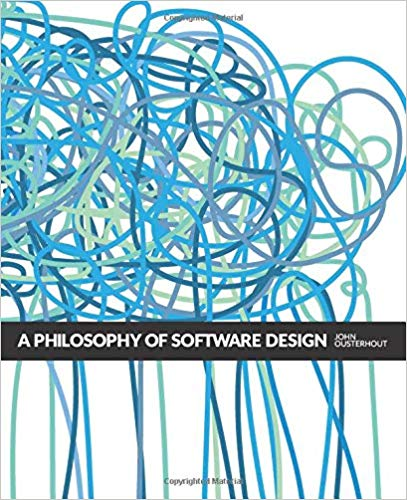
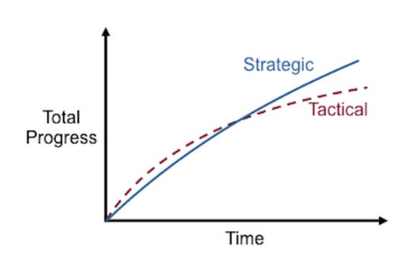
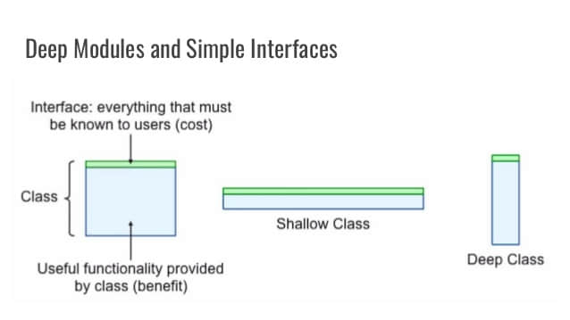
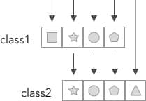
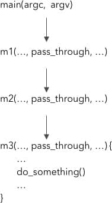

## 前言

从写上一篇博客到现在，不知不觉竟然已经过了快一年的时间。忙碌了快一年，终于稍微有点空闲的时间重新开始写作，于此同时，我也回顾了一下去年写作的一些选题，反思之后，我希望今年能够多写一些更有深度的内容。因此也有了这篇文章的诞生。

这篇文章不能算作算是完全原创的内容，而是汲取了干货之后外加个人吸收所产生的一些想法。请不要因此就失去了读下去的耐心，因为本篇文章的知识来源的确是难得的宝藏。下面，就请随我一同，汲取来自 **[A Philosophy of software design](https://www.amazon.com/Philosophy-Software-Design-John-Ousterhout/dp/1732102201)** 这本书的哲思。

这本书应该是 2018 年我所读过的**最有价值**的一本书，因此书中的内容也非常值得学习和分享。

## 作者简介


这本书的作者是 [John Ousterhout](https://en.wikipedia.org/wiki/John_Ousterhout)，目前是斯坦福大学的计算机系的教授，同时也是大名鼎鼎的 [Raft(著名的分布式算法)](<https://en.wikipedia.org/wiki/Raft_(computer_science)>) 和 [Tcl](https://zh.wikipedia.org/wiki/Tcl) 的发明者。

作者曾经还参与过三个操作系统从零到一的开发，开发过多文件存储系统，许多基础设施工具，比如 debugger，构建系统，GUI 工具库，脚本语言，可交互的文本编辑器等。光是这些 `Title` 和经历都能吓死一般人，不过我们还是以事实说话，来看看他写的这本书到底有何优秀之处。

可惜的是本书刚出不久，只有英文版，因此笔者也是下了很大的精力去研读这本书。

如果没有条件看书的小伙伴，可以在 YouTube 上看一下作者本人在 [Google 内部的演讲](https://www.youtube.com/watch?v=bmSAYlu0NcY), 也能够大概一览本书的风采。

## 写作背景

自从人们开始给计算机写编写程序到现在已经很久了。业界也有很多关于软件开发流程的讨论，比如**敏捷开发 (Agile Development)**。也有很多关于编程工具，比如 debugger，版本控制系统，测试工具的讨论。以及对编程技巧和技术的广泛和深度的分析，比如**面向对象编程 (Object-oriented Programming)**和**函数式编程（Functional Programming）**, **设计模式（Design Patterns）**和**算法（Algorithms）**。

但是**软件设计**本身并没有很广泛地被讨论和触及。David Parns 于 1971 年发表的 **[将系统划分为模块的准则 (On the Criteria To Be Used in Decomposing System into Modules)](https://www.win.tue.nl/~wstomv/edu/2ip30/references/criteria_for_modularization.pdf)** 经典论文探讨了一些关于软件设计的基本问题。但是到今天为止，关于软件设计的问题探讨却没有什么明显地进展。

作者认为，计算机科学的最基本的问题是 —— **问题分治**(如何将一个复杂的问题换分成更小的问题以便于独立地解决)。然而在现在世界各地的大学里面，都没有针对这一在软件设计中的核心任务开设课程。学生在大学里能够学到 OOP，但是却没能学到软件设计。

因此作者产生了一些想法:

1. 是什么区分除了伟大的程序员和普通的程序员，是否能够把让他们变得伟大的一些技巧在课堂中教授出去
2. 作者假设伟大的程序员和普通的程序员的鸿沟在于伟大的程序员拥有更好的软件设计技巧
3. 作者想通过实验性地在大学里教授**软件设计**来验证这一观点

这就是本书以及斯坦福 [CS 190](https://web.stanford.edu/~ouster/cgi-bin/cs190-winter18/index.php) 这门课诞生的缘由。这本书也反应了作者的职业生涯中真实经历，以及本书所提及的一些原则和技巧成功地在他的编码生涯中被运用。

作者也指出，希望大家**辩证地进行阅读**，尽情地根据自己的实际经验和情况去深度思考和对比。

> 这里顺便插一句，Jeff Dean 也给作者在写这本书时提供了很多建议和意见，如果你不知道 Jeff Dean 是谁，那就赶紧 Google 一下吧~

---

## 一场对抗复杂度（Complexity）的持久战

编程是人类历史上最纯粹的智力性创造活动。编程不需要任何身体上技巧或者是协调性，不像打篮球和芭蕾那样，编程只需要一颗有创造性的头脑以及如何利用这颗头脑来组织你的想法。那么软件的复杂度从何而来呢？

### 复杂度从何而来

正是应为编程是如此地自由而不受限制，随着程序不断地演进，解决了一个又一个问题，伴随着程序组件之间难以觉察的依赖关系，程序就变得越来越复杂了。

正如[热力学第二定律](https://zh.wikipedia.org/wiki/%E7%83%AD%E5%8A%9B%E5%AD%A6%E7%AC%AC%E4%BA%8C%E5%AE%9A%E5%BE%8B)中对于熵的描述 -- 孤立系统自发地朝着一个平衡的方向不断发展即**最大熵状态**（在这里我们所说的熵指的是信息的熵），软件开发也是如此，随着时间的迁移和对软件的不断修改，程序员将越来越难在脑袋中保存软件的所有关键因素，这就会导致 bug 的产生，降低开发的速度。

对于所有的软件来说，复杂度的逐渐增长是一种不可避免的趋势。程序越庞大越复杂，参与开发的人数越多，复杂度增长的速度以及管理复杂度的难度将变得愈来愈大。因此编写软件最大限制在于**开发者对于自己开发的系统本身的理解**。

好的开发工具可以在一定程度上减轻复杂度，让我们更加便捷和低成本地进行开发，但是我们仍然要找到让软件变得更加简洁的办法，因为简洁的设计能够让我们在复杂度彻底失控之前就构建出强大的系统。

### 如何对抗复杂度

一般来说，主要两种解决复杂度的方法，作者对这两种方法都进行了详尽的讨论：

1. **使代码变得更加简洁和意图明显来对抗复杂度**
2. **使用封装 —— 模块化设计**

本书的核心观点也都是建立在如何降低软件的复杂度上。

### 软件设计是持久战

作者认为软件设计贯穿着软件开发的整个生命周期。这也是为什么现在[瀑布模型](https://zh.wikipedia.org/wiki/%E7%80%91%E5%B8%83%E6%A8%A1%E5%9E%8B)几乎很难正常进行下去，而[敏捷开发](https://zh.wikipedia.org/wiki/%E6%95%8F%E6%8D%B7%E8%BD%AF%E4%BB%B6%E5%BC%80%E5%8F%91)成为如今大多数团队的选择的原因。

因为敏捷开发是一种**增量**的开发方式，而增量式的开发意味着对软件的设计从来不会完全停止，同时，增量开发也意味着持续不断地**重新设计**。

### 如何学习并运用好这本书

- 不断地进行 **Code Review**
- 学会辨认那些会增加软件复杂度的代码或者行为的**特征（Red Flag）🚩**
- 尝试使用**多种方案**来解决上面提到的那些特征
- 不要**极端地（Taking it too far）**使用某条原则，每个原则都有自己例外和限制

### 原则一览

书中讨论的比较重要的软件设计原则有以下几点（并不一一对应接下来的章节）:

> 这里笔者提供了原英文描述，若有勘误还请指正。

1. **复杂度是不断递增的 —— 不要忍受那些看似微小的问题（Complexity is increamental: you have to sweat the samll stuff）**
2. **正常工作的代码是远远不够的（Working code isn't enough）**
3. **持续地累积对软件设计有提升的行为（Make continual small investments to improve system design）**
4. **模块应该是深的（Module should be deep）**
5. **对接口设计应该让那些最通常的用法变得尽量简单（Interfaces should be designed to make the most common usage as simple as possible）**
6. **让模块拥有一个简洁的接口比拥有一个简洁的实现要更重要（It's more important for a module to have a simple interface than a simple implementation）**
7. **通用模块通常更具深度（General-purpose modules are deeper）**
8. **分离处理通用情形和处理特殊情形的代码（Separate general-purpose modules and special-purpose code）**
9. **不同的层应该使用不同的抽象 (Different layers should have different abstractions)**
10. **下沉复杂度 (Pull complexity downward)**
11. **消灭错误 (以及特殊情况)（Define errors (and special cases) out of existence）**
12. **进行二次设计（Design it twice）**
13. **注释应该描述那些在代码中不明显的信息（Comments should describe things that are not obvious from the code）**
14. **软件应该被设计成容易阅读而并非容易实现（Software should be designed for ease of reading, note ease of writing）**
15. **软件开发的增量部分应该是抽象而非特性（The increments of software development should be abstractions, not）**

## 软件复杂度的本质

要想知道如何减少软件的复杂度，首先要知道如何辨认复杂度。而识别出软件中的复杂度也是一项关键的技巧。

### 复杂度的定义

作者是这样定义复杂度的：

> 复杂度是任何与软件系统结构相关的任何东西，它使得系统难以被理解和修改

复杂度可能以很多的形式来呈现，比如系统中的某一块代码难以理解，也可能是不知道要修改系统的哪一部分才能对其改进，亦或是没办法很轻松的修复一个 bug 而不导致其他 bug 的产生，等等。

不过值得注意的是，**复杂的系统并不一定有很高的复杂度**，可能一个系统庞大且有很多复杂的功能，但是却很容易在上面展开工作，那么对于这个系统而言，它**复杂度并不高**。

复杂度由系统中最常见的和活跃的部分决定，如果我们用一个数学表达式来表达系统的综合的复杂度：

$$
C = \sum_{\mathclap{p}} c_pt_p
$$

系统 C 的综合复杂度由系统的每个部分 p ($$c_p$$) 的复杂度和由开发人员在该部分上工作所花费的时间 $$t_p$$ 加权计算而来。

由此可知，即使一个系统有一些部分非常复杂，但是那些部分几乎不需要再被接触，那么它们对整体的系统复杂没有很大的影响。

### 复杂度的症状

复杂度通常以以下三种形式所展现:

1. **修改放大 (Change amplification)** -- 一次看似简单的改动却需要同时修改多个地方
2. **认知负担 (Cognitive load)** -- 为了完成一项任务需要知道很多的信息，比如晦涩难懂的写法，四处分散的全局变量，不一致性，模块之间的互相依赖等
3. **未知的未知数 (Unknown unknowns)** -- 不知道完成某一项任务需要改动代码的哪些部分，或者不知道需要哪些信息才能够完成一个任务

在上面三种症状中，**未知的未知数**是最为严重的，因为这意味着，有些事情你必须了解才能正确地完成某个任务，但是你却不知道要如何了解这些事情，又或者是这些事情背后有什么隐情（或许是一些历史包袱）。

而前面两者是相对来说比较好解决的，或者说是烦人但却不至于严重影响工作。所以产出好的设计的一个重要的目标就是让系统变得**明显和易于理解**。

### 产生复杂度的原因

一般来说，复杂度主要由**不正常的依赖 (Dependenices)**和**信息晦涩 (Obscurity)**所导致。**依赖**本身作为软件开发最重要的元素之一，是不可能被完全剔除的，因此对于软件设计来说，主要的目的便是使依赖变得清晰和简洁。对于**信息晦涩**而言，体现的方面就更多了，比如变量名起得过于通俗，缺少文档，隐式依赖等。这些细节会在之后的设计原则中详细地讨论。

### 复杂度小结

复杂的系统就像罗马一样，不是一蹴而成的，常常是由微小的复杂的部分积累而来。开发者若是经常抱着 "影响很小的，没关系的" 这样地心态来进行每一次变更，那么很快，系统的复杂度将不受限制地增长。而修复一个不正常的依赖和解决一个信息晦涩的问题，则会有所不同。为了限制复杂度的增长，我们应该采取**零容忍**的哲学，让未来变得 💪 更好。

---

接下来，我们就进入正题，来看看书中强调的这些软件设计原则

## NO.1 正常工作的代码是远远不够的（Working code isn't enough）

这个一条原则说的是开发人员在执行一个编程任务时的**心态**。很多公司或者组织鼓励一种战术性的心态 —— **专注于快速实现功能**。

然而，如果你追求的是一个良好的软件设计，那么你必须付出额外的时间来产出一个具有更好设计的实现的心态。

### 战术性编程 (Tactical Programming)

大部程序员采取的都是一种叫做**战术性编程**的思想状态，专注于实现功能或者修复 bug。然而战术性编程的问题在于经常会让开发者变得**短视**。结果，可能是为了赶上 DDL 或者尽快地完成任务而说服自己加入一些产生复杂度的代码或者是使用拼凑出来的解决方案，然而这样却会使得系统更快地变得复杂，尤其是开发这个系统的所有人都采取这样的思路的时候。

过不了多久，之前埋下的恶果开始导致一些问题，然后开发者便会开始后悔当初走了捷径。

**一旦你采取了战术性编程的思想，往往很难再停下来了。**

### 策略性编程 (Strategic Programming)

成为一个更好的程序设计者的第一步就是要意识到：**仅仅只能正常工作的代码是远远不够的**。最重要的事情应该是系统的长远的结构。

所以你的首要任务应该是产出一个良好的设计，并且在持续在工作中投入一定的时间来进行设计。这些投入可能从短期上来看会降低你的开发速度，但是从长期来看却可以让你更加迅速无阻地开发。

当然，不论你预先投入了多少时间在设计上面，错误依旧是不可避免的。所以你还需要继续投入时间来修复这些问题，并且不断地贡献一些小的优化，这样系统才能持续地保持复杂度在一个较能接受的水平。

### 权衡投入



那么可能有人要问了，我需要投入多少额外的时间才算合理呢？巨大的提前投入，比如设法一次性设计整个系统，往往效果不好，这就像瀑布模型一样。理想的的设计趋向于不断地吸收微小的部件和变动，因此不断地对系统设计进行投入才是合理之道。

一般来说，投入 **10% - 20%** 总开发时间是比较理想的，当这个系统开发地足够久了，这些设计投入会看起来微不足道，但是系统从中获得的好处确实无法衡量的。同时，你多投入的这些时间很快会给予你会报，为你之后的开发节省大量的时间。

反而言之，如果你一直采取战术性编程，那么很快你的开发速度就会慢下来，并且越来越慢，最后你一开始剩下来的那点时间也变得微不足道了。

### 小结

良好的软件设计是需要付出代价的。所以它应该是你需要持续投入的东西，这样，微小的问题才不会一直积累成巨大的雪球直到压垮你的系统。

幸运的是，好的设计总会回馈给你，并且比你想象得要快。所以请把它当做今天就要做的任务，而不是推迟到明天，后天，或者大后天，因为你等待得越久，你面临的问题就会更严峻。

---

## NO.2 模块应该是深的 (Modules Should be Deep)

**模块化设计**是管理系统复杂度的重要技巧之一，模块化设计使得开发者只需要面对系统综合复杂度的其中一小部分。

模块化设计可以是不同形式的，比如**类（clasess）**，**子系统（subsystems）**，或者**服务（services）**。在理想世界当中，每个模块都完全互相独立，不依赖与对方。然而在现实世界，这是无法做到的。模块必须要组合在一起，以调用其他模块的函数或者方法，模块与模块之间必须要知道对方的存在这就是模块之间的依赖。

**模块依赖**的形式也可以有很多种，并且也可以是难以察觉的依赖。而模块化设计的目标也是尽可能地降低模块之间的依赖。

### 关于模块

为了更好地管理依赖，我们将模块看作两部分：**接口（interface）**和**实现（implementation）**。接口描述了该模块的目的以及模块如何达成该目的，而实现则是由实现该模块承诺的代码组成的。

对于本书的目的而言，**模块可以是任何包含接口和实现的代码单元**，比如任何 OOP 编程语言中的类，或者类中的方法，非 OOP 变成语言中的函数，乃至是更高层级的子系统或者服务（他们的接口呈现出不同的形式，比如内核调用，发送 HTTP 请求等），都可以看作是模块。

### 接口里有什么

一个模块的接口里，包含了两种类型的信息：**正式（formal）**的和**非正式的（informal）**

正式的信息通常在代码中显式地指定了，比如一个方法的**签名（signature）**（包含了名称，参数，返回值，可能抛出的异常等）。而每个接口也包含了一些非正式的元素，比如使用的场景限制，调用顺序等，都是接口的一部分。

通常来说，如果一个开发者需要知道一些特定的信息才能够使用某个模块，那么这个信息就属于模块接口的一部分，而非正式的信息只能够通过注释来描述。对于大部分模块来说，接口的非正式信息部分要比正式信息的部分要更大，更复杂。

### 抽象（Abstractions）

抽象和模块化设计是紧密关联的。**抽象是一个实体的简洁的展现，它忽略了不重要的细节。**

在模块化编程当中，每个模块都以接口的形式提供了一个抽象。对于模块的抽象而言，其实现是不重要的信息。**而抽象忽略的不重要的信息越多越好**。

抽象往往容易走向错误的方向，常见的错误有两种：

- 包含了不重要的细节 —— 使得抽象更加复杂
- 忽略了重要的细节 —— 使得信息晦涩，使得开发者难以理解和正确地运用该抽象

**设计抽象的关键在于理解什么是重要的信息，并且寻找一种可以最小化这种重要信息的设计。**

其实，我们不仅依靠在编程中依赖抽象来管理软件复杂度，抽象在日常生活中也无处不在。比如，汽车提供了一个足够简单的抽象让我们去驾驶它而不需要学习任何关于马达，能量管理，防抱死制动器，恒速操纵器等的知识。

### 深模块 (Deep Modules)

**最好的模块是那些既提供了强大功能但又有着简单接口的模块。**

> 作者用 deep 这个词来形容这样的模块，笔者将其翻译为深模块

如果我们要视觉化 “**深度（depth）**” 这个概念，请把每个模块想象成一个矩形。矩形的面积代表的就是模块所实现的功能，矩形顶部的边缘代表着模块的接口。边缘的长度越短，代表接口的复杂度越低。



模块的深度也是一种思考代价和好处的方式。一个模块所能提供好处来自于它提供的功能，而代价（对于系统复杂度而言），便是它的接口。**一个模块的接口代表着这个模块给系统的所带来的复杂度 —— 更小更简洁的接口带来的复杂度更低。**

接口本身是好的，但是更多，更大更复杂的接口并不意味着更好。

Linux 中负责文件 I/O 的模块，就是一个深模块的很好的例子。一共只有五个最基本的 I/O 系统调用，并且都有简介的签名：

```c
int open(const char* path, int flags, mode_t permissions);
ssize_t read(int fd, void* buffer, size_t count);
ssize_t write (int fd, const void* buffer, size_t count);
off_t lseek(int fd, off_t offset, int referencePosition);
int close(int fd);
```

`open` 系统调用接受一个分层级的文件名， 比如 `/a/b/c` 然后返回一个整形的文件描述符（file descriptor）作为打开的文件的引用。其他的参数为 `open` 提供了可选的信息，比如打开文件时是用于读还是写，是否在打开一个不存在的文件时直接创建，以及创建文件时的访问权限等。`read` 和 `write` 系统调用则在缓冲区传输信息，`close` 结束文件的访问。大多数文件是按照顺序访问，所以这个行为是默认的，但是随机访问也可以通过调用 `lseek` 这个系统调用来改变当前访问的位置。

现代 Unix 操作系统的 I/O 接口需要成百上千行代码，都是为了解决类似这些问题:

- **如何将文件在磁盘上表示，以便于更加高效的访问？**
- **目录是如何存储的，分层级的路径名是如何进行处理并定位到某个文件的？**
- **文件权限是如何保证的，这样用户才无法删除其他用户的文件？**
- ...

这些问题，甚至更多，都在 Unix 的文件系统的实现中处理了。他们对于使用这些系统调用的程序员来说是不敏感的。Unix I/O 的接口的实现这些年已经变化地很彻底了，但是这五个最基本的内核调用却没有改变。

**像这样的深模块，易于使用，但是却隐藏了绝大的实现上的复杂度。**

### 浅模块（Shallow modules）🚩

另一方面，**浅模块是那些其接口相对于其提供的功能更复杂的模块**。比如，一个实现**链表（Linked List）**的类是浅模块。操作链表的实现不需要很多代码（插入，删除一个元素只需要几行代码），所以链表的抽象并没有隐藏很多的细节，其接口的复杂度几乎和它实现的复杂度一样。

浅类有时候是无法避免的，但是它们对管理软件复杂度来说，提供不了什么帮助。

### 皆可 "类"（Classitis）

不幸的是，深类的价值在今天并不被广泛地接受。传统的编程观点认为，类必须要小（small），而不是深（deep）。可能你还会经常听到这样的观点: “任何超过 N 行的方法都必须要被拆分成不同的方法”。这种做法会导致产生大量的浅方法和浅类，然后系统整体增加复杂度。

因此作者给这种极端地 **“类必须要要小（Class should be samll）”** 的做法，起名为 **"Classitis"**, 而这种做法来源于 **“类非常好，越多的类越好（Classes are good, so more classes are better）”** 的错误想法。

### 小结

通过分离模块的接口和实现，我们能够将实现的复杂度对系统的其他部分隐藏起来。模块的用户只需要理解接口所提供的抽象就可以了。因此，在设计类和方法的时候，最终要的事情便是让他们变得深，给普遍的用例提供简单的接口，但依旧提供重要的功能。

---

## No.3 信息隐藏和泄露（Information Hidding and Leakage）

在上面一条原则中，我们理解了为什么模块应该要深，本条原则则讨论的是创建深模块的一些技巧。

### 信息隐藏（Information hidding）

实现深模块的重要技术之一便是使用**信息隐藏**。这个技术的基本思想是：**每个模块应该封装一些体现设计决策的信息**。这些信息植入在模块的实现当中而不会出现在模块的接口里，因此对其他模块不可见。

这些隐藏的信息通常包含了模块的实现机制的细节，比如：

- **如何在 B 树种存储数据并且高效地地对数据进行访问**
- **如何确定一个文件的物理磁盘区块（physical block）和逻辑区块（logical block）的对应关系**
- **如何实现 TCP 网络传输协议**
- ...

这些隐藏的信息可以包含和模块实现有关的数据结构和算法，也可以包含一些高阶的抽象概念，约定俗成等，比如推测该模块通常情况下操作的都是小文件。

信息隐藏主要从两个方面减少复杂度：

1. 通过简化模块的接口，减少使用该模块的开发者的认知负担 (比如，使用 B 树的人通常不需要关心数据的存储形式)
2. 信息隐藏便于系统的升级，模块外部对改模块隐藏的信息没有依赖关系，那么对与该模块隐藏信息的变更将不会影响系统的其他部分 (比如，TCP 协议的拥塞机制的变更，通常不会隐藏高层代码的变更)

因此，在设计一个新模块的时候，应该认真思考什么信息应该被隐藏在模块之中，如果你能够隐藏更多的信息，那么你便能使得模块结构变得更简洁，并且让模块变得更深。

> 注意：在支持 OOP 的编程语言中，使用 **private** 关键字来隐藏方法和变量，不能算是信息隐藏。（可以思考一下为什么）

### 信息泄露（Information Leakage）🚩

与信息隐藏对立的便是信息**泄露**。信息泄露通常出现在**设计决策同时被多个模块影响的时候**。这样会在模块之间形成依赖关系，任何因为设计决策的更改都会导致所有关联模块产生变动。

如果一部分信息直接反映在接口当中，那么根据定义，这部分信息已经泄露了。**因此，简洁的接口与信息隐藏的程度往往有很大联系**。

举个例子，假设有两个类包含都某个文件的格式**（format）**的相关信息（可能一个类使用该格式来读取文件，另一个类按照该格式写入文件），他们都依赖于这个文件格式。如果这个文件的格式发生了改变，那么两个类都需要修改。

**像这样的隐秘的信息泄露比直接在接口上泄露还要严重**，因为它让人非常难以察觉。

**如果你遇到这样的问题，问问自己：“我要如何重新组织这些类，这样特定的信息指挥影响单个类呢？”**另外一个可能解决途径是将这部分信息从受影响的类当中抽离出来，创建一个新的类进行封装，然而这个方法只适合在你能够找到一个简洁又合适的接口来将其细节抽象化的时候。

### 时序的解耦（Temporal Decomposition）🚩

另外一个导致信息泄露的设计风格，作者称其为**“时序的解耦”**，这是什么意思呢？

在这种设计中，**系统的结构对应操作的时序**。想象一下，有个一个程序，它负责读取一个文件，之后修改文件的内容，最后保存对该文件的修改。在时序的解耦中，这个程序可能会被划分成是三个类：一个负责读取文件，一个负责修改其内容，另外一个负责写入文件。**其中读取和写入的步骤都需要了解文件的格式，因此这种划分就造成了信息的泄露。**解决方案是将核心的读取和写入文件的机制都合并在同一个类当中。

我们往往很容易掉进时序上的解耦的陷阱，因为操作的时序经常在你编码时出现在你的脑海中，你会下意识地根据时序来对代码进行划分。

通常来说，时序是很重要的，它会在应用的某些地方反映出来，但是时序不应该反映在模块的结构当中，除非这个结构与信息隐藏的理念一致（或许，在时序的不同阶段，代码所需要的信息完全不同）。**当我们在设计模块的时候，应该专注于该模块所执行的任务的所需信息，而不是任务出现的顺序。**

### 过度暴露（Overexposure）🚩

在作者开设的课程中，有让学生实现一个 HTTP 服务的项目。其中在生成 HTTP 响应的这部分功能中，学生在实现这部分犯的最常见的错误是缺少**缺省值（defaults）**。我们都知道无论是 HTTP 请求还是响应都需要在头部指定 HTTP 协议的版本号，作者的其中一个学生小组设计的 API 需要调用者手动指定 HTTP 协议的版本号。

然而 HTTP 响应的版本号必须要和 HTTP 请求的版本号一致，虽然调用者能够获取到 HTTP 响应的对象，但是调用者甚至可能不知道要指定什么版本号，因此让 HTTP 类来自动处理协议版本号的事情显然是更合理的。如果调用者真的手动设置了版本号，那么说明这个 HTTP 库之间的模块出现了**信息泄露**。

同时，**缺省值还展现了一个重要的原则**: **接口的设计应该让常见的情况变得越简单越好。**一般情况下，用户都不需要知道缺省值的具体情况，而在一些少数情况，用户可能会需要知道该信息，并且调用一些特殊的方法来覆盖它。

无论在什么情况下，模块都应该显示地 **“做正确的事情（Do the right thing）”**而无需主动过问，缺省值就是一个例子。

### 过度隐藏

另外一个问题是对于信息的过分隐藏。信息只有在模块外部不需要被用到时进行隐藏才合理。如果模块外部需要知道这个信息，那么就不应该将其隐藏。

比如模块的性能是由某个特定的配置参数决定的，而模块的不同用法，需要设置不同的参数。那么在这个情形中，将这个参数向外暴露是很重要的，这样使用者才能正常地依据其场景来进行决策。

### 小结

信息隐藏和深模块是紧密关联的，如果一个模块隐藏了很多信息，那么它趋向于增加了许多模块的功能同时也简化了接口的信息，模块则变得更深了。

反之，如果一个模块并没有隐藏多少信息，那么要么这个模块没提供多少功能，或者是它的接口很复杂，不管怎样，这个模块便很浅。

---

## No.4 通用模块通常是深的（General-purpose modules are deeper）

在设计一个新模块的时候面临的最常见的选择便是要将这个模块实现成一个更加**通用的模块（general-purpose）**还是更加**专用的模块（special-purpose）**。实现通用模块似乎和我们之前谈论到的多花些时间来设计的思想是一致的。

另一方面，我们都知道系统未来的需求是难以预测的，所以实现一个通用的模块可能会包含一些将来永远用不到的功能。此外，如果你实现得过于通用，那么很可能这个模块也不能很好地解决你现在所面临的问题。而如果你总是实现专用的模块，并且在将来再发掘更多的用例，那么你总是要回头来重构这些模块，让它变得更通用。

那么这两者天生就是矛盾的吗？

### 让模块稍微变得通用（Make modules somewhat general-purpose）

在作者的经验中，最佳的切入点是以一种 **”稍微通用的方式 (somewaht general-purpose fashion)“** 来实现新模块。**”稍微通用的方式”**这个措辞指的是模块提供的功能应该反映你现在的需求，但是接口却应该设计得足够通用以满足多种用法，并且接口的对于现在的需求来说要足够易用，而不需要进行特殊的处理。

“稍微” 这个概念是很重要的：不要忘乎所以，构建得过于通用而使你现在的需求难以对接。

最重要的是，通用的模块的好处在于提供了比专用模块更简洁且深的接口，并且可以在未来需要复用该模块的时候节省你的时间。即使这个模块之后也是按照原来的方式使用，通用模块的实现方式也要更加的简洁。

### 真实的例子: 一个文本编辑器（editor）应用

在作者开设的课程中，学生需要设计并编写一个简单的 GUI 文本编辑器。

编辑器可以显示一个文件的文本内容，并且允许用户点击，输入和编辑文本内容。同事，编辑器还需要支持多窗口同步显示和修改，也许需要支持多级撤回（undo）和重做（redo）的功能。

每个学生的项目都包含了一个类来管理文件中的文本。这个类通常提供一些方法来加载文件到内存中，读取和修改文本内容，并且将文本内容重新写入到文件中。

许多学生小组都为**Text 类**实现了多个专用的 API, 他们知道这个类将用来处理文本编辑器的交互，所以他们认为编辑器必须要提供这样的定制的 API 来实现其功能。

比如，他们实现了针对 **backspace** 和 **delete** 键的功能：

```c
void backspace(Cursor cursor);
void delete(Cursor cursor);
```

这两个方法都接收光标的的位置作为参数（用一个专门的 **Cursor** 类来代表光标的位置）。编辑器必须还支持某个文本选择区域的删除或者复制，因此学生们针对这个情况又实现了 **Selection** 类，以及一个接收该类为参数的方法来处选择区域的删除：

```c
void deleteSelection(Selection selection);
```

这些学生可能认为面向用户界面的操作来实现对应的方法会比较简单。然而在现实中，这种特殊化为实现用户界面带来的好处微乎其微，并且给未来可能在实现用户界面的代码或者 Text 类上开展工作的开发者带来**很高的认知负担（high cognitive load）**。

这种做法在用户界面实现和 Text 类之间产生了信息泄露。用户界面的抽象，比如选择和按下 backsapce 键的操作，都体现在了 Text 类当中。并且，每个新增的用户界面操作都要在 Text 类中定义一个新的方法，所以最后开发者很可能要同时地开发用户界面和 Text
类。

### 一个更加通用的 API 实现

一个更好的实现方式是，让 Text 类变得更加通用，它的 API 应该只定义那些最基本的文本相关的功能，而不需要反映更高阶的行为，而那些操作则会利用 Text 类来实现他们想要的功能:

```c
void insert(Position position, String newText);
void delete(Position start, Position end);
```

同时，这个 API 实现还拥有个一个更通用的类型 —— `Position`, 而不是反映了特殊的用户界面的 `Cursor`。Text 类还需要提供一个通用的功能来操作文本内部的位置属性：

```c
Position changePosition(Position position, int numChars)
```

这个方法返回一个新的位置，相对于 `numChars` 指定的偏移，如果 `numChars` 是正数，那么新的位置就在 `position` 之后，反之则在 `position` 之前。这个方法也自动跳过了前一行和后一行的概念。有了这个方法，按下 `delete` 键的操作就可以这样实现（假设 cursor 变量保存着当前鼠标的位置）:

```c
text.delete(cursor, text.changePosition(cursor, 1))
```

同样的，按下 `backspace` 就可以这样实现:

```c
text.delete(text.changePosition(cursor, -1), cursor)
```

有了 Text 类的通用 API，新的实现变得更加明显，将来需要在用户界面代码部分工作的开发者将不需要关心哪个字符被那个按键删除了。而在老的实现当中，开发者必须要跑到 Text 类的实现当中寻找答案并且验证其行为。

此外，更通用的实现总体来说需要的代码量也更少，因为它替换了一大部分 Text 类中的特殊方法。假设之后还需要实现文本编辑之外的功能，比如根据关键查找和替换文本，那么之前定制的 `backspace` 和 `delete` 方法便完全起不到作用。然而通用的 Text 类则已经包含了大部分针对新的需求的功能，所缺的只是一个查找下一个匹配文本的的功能:

```c
Position findNext(Positon start, String string);
```

### 通用性使得信息能够被更好地隐藏

在上面的例子当中，通用的事件将用户界面和 Text 类分离得很干净，因此它使得信息被更好地隐藏起来。软件设计中最最重要的元素之一便是决定谁在什么时候应该需要知道什么样的信息。当一些细节很重要的时候，最好是让它们尽量地明显。

### 自我拷问

作者提供了一些问题，用于帮助我们通用和专用的接口实现之间做出平衡:

- 能够覆盖我当前需求的最简洁的接口实现是什么？
- 这个方法在多少种情形下会被使用？
- 这个 API 对于我当前的需求来说是否易于使用？

### 小结

在很多方面，通用的接口都比专用的接口更胜一筹。它往往更加简洁并伴随着比专用模块更深的方法，并且还很清晰地将类分离开来，而专用的接口往往在类之间泄露信息。

让你的模块变得稍微通用这种方法减少系统综合复杂度最好的方法之一。

---

## No.4 不同的层，不同的抽象（Different Layer, Different Abstraction）

软件系统经常以不同的层组合在一起，高高层使用低层所提供的设施。在一个设计良好的系统当中，每一层都提供了一个不同的抽象来区别于其他层。比如：

- 在文件系统中，最上面的层实现了对于**文件（file）**的抽象。接下来一层实现在文件系统中固定大小磁盘区块在内存中的缓存。而最低层则由设备驱动组成，处理数据区块在其他存储设备和内存中的移动。
- 在像 TCP 这样的网络传输协议当中，顶层提供的抽象是一段字节流在不同机器之间的**稳定传输**，而这一层则建立在有些大小的传输数据包在不同设备之间的**尽力而为（best-effort）**的传输（大多数数据包会传输成功，少数则会丢失或者乱序到达）

而如果一个系统内相邻的层有着类似的抽象，那么说明层之间的分解存在着问题。

### 透传方法（Pass-through methods）

**当相邻的层有着相似的抽象时**，经常以**透传方法**的形式呈现出来。透传方法指的是一个方法的主要作用是调用另外一个方法，并且该方法的签名和其调用的方法的签名相似或等同。

比如，在之前提到的实现 GUI 编辑器的项目中，一个学生设计出的一个类中的方法几乎全是透传方法:

```java
public class TextDocument ... {
  private TextArea textArea;
  // ...

  public Character getLastTypedCharacter() {
    return textArea.getLastTypedCharacter();
  }
  public int getCursorOffset() {
    return textArea.getCursorOffset();
  }
  public void insertString(String textToInsert, int offset) {
    textArea.insertString(textToInsert, offset);
  }

  // ...
}
```

透传方法让类变得更浅，并增加了接口的复杂度，也增加了类的复杂度，但是却没有给系统总体增加什么功能。**透传方法标志着类之间的职责划分出现了混淆**。

在上述例子中，`TextDocument` 类提供了一个 `insertString`, 但是插入文字的真正实现却在 `TextArea` 类当中，通常这是一个不好主意：**因为接口所对应的一个功能应该在相同的类中实现**。



当你发现类与类之间出现了透传方法的时候，考虑这两个类并问问自己：”其中的功能和抽象到底是由哪一个类所负责的？“

解决透传方法的方式是重构这两个类，让每个类都拥有区分明显，条理清楚的职责，作者提供了三种方法：

1. 暴露出低层的类直接让给调用者消费
2. 重新分配两个类的功能
3. 如果两个类无法解开，那么最好解决方式就是将它们合并

### 什么时候接口的重复是 OK 的呢？

方法有着同样的签名并不一定总是不好的。重要的是每个新的方法都应该提供有意义的功能。**透传方法之所以不好，正是因为他们都没有贡献新的功能**。

**`Dispatcher（分发器）`** 便是其中一个例子。`Dispatcher` 是一个用来更根据传入的参数来选择其他几个需要调用的方法，然后它会将自身大部分或者全部的参数都传递给要调用的方法。`Dispatcher` 方法的签名通常和它要调用的方法的签名一样。即便如此，`Dispatcher` 也挺了有意义的功能。

比如，在一个 `Web Server` 当中，当收到即将到达的 HTTP 请求的时候，便会调用 `dispatcher` 来检查请求的 `URL`，然后选择一个特定的方法来处理这个请求。

所以，几个不同的方法拥有相同的签名是没问题的，只要他们本身都提供了有用并区别于其他方法功能即可。

另外一个例子是**带有多重实现（multiple implementation）的接口** —— 诸如操作系统上的磁盘驱动。每个磁盘驱动都提供了针对不同磁盘的支持，但是它们都有着相同的接口。像这样的方法通常都处于系统的同一层中，并且它们不会互相调用。

### 装饰器（Decorators）

装饰器是一个鼓励 API 在不同层之间重复的一个设计模式。本文不对[装饰器模式](https://en.wikipedia.org/wiki/Decorator_pattern)做过多的解释，感兴趣的同学可以自行了解。

举个例子，在窗口系统中，一个 `Window` 类实现了一个无法滚动的简单窗口，然后 `ScrollableWindow` 类通过装饰 `Window` 类来为其添加垂直和水平方向的滚动条。

装饰器的动机在于通过对更为通用的核心部分的扩展来分理处特殊的情况。然而，装饰过的类往往变得很浅：为了添加数量不多的新功能而引入大量的**样板（boilerplate）代码**。装饰过的类通常包含许多透传方法。这种模式常常被过度使用，为每个很小的功能都创建一个新的类。这便引起了前模块爆炸式增长。

在创建装饰类之前，可以进行以下的考虑：

- 是否可以直接在基础的类上添加新的功能而不是创建出一个装饰类？当新的功能相对通用的时候，这个做法就比较合理
- 如果新的功能是针对一个特别的用例，是否可以将这个用例合并，而且不是创建出一个单独的类
- 最后，问问自己新的功能是不是真的需要包装在现有的功能之上

总的来说，有时候使用装饰器是合理的，但是通常来说都有更好的办法。

### 透传变量（Pass-through variables）

另外一个 API 在不同层之间重复的形式是**透传变量**，指的是同一个变量在一串很长的调用链中一直透传下去。



透传变量增加了复杂度，因为他们强迫所有的中间方法要意识到该变量的存在，即使这些方法更本就用不到这个变量。更进一步，如果要引入一个新的变量，那么你可能需要修改大量的接口和方法来将这个变量透传至相关的路径上。

消除透传变量是充满挑战的，其中一个方式就是取寻找在调用链最顶层的方法和最底层的方法之间是已经存在一些共享的对象，然后将透传的变量放到共享的对象当中。然而，**这样一个对象，很有可能它本身亦是一个透传变量**。

另外一个方法是将信息存在全局变量中，虽然它避免了方法和方法之间的信息传递，但是全局变量又会制造出其他的问题。比如，在同个系统的同个进程下创建两个完全独立的实例是不可能的，因为他们对全局变量的访问会产生矛盾。

而作者用的最多的一种解决方案是引入一个名为**上下文对象（context object）**的概念。一个上下文存储了应用所有的全局状态，大多数应用在它们的全局状态中都有很多个变量，比如配置选项，共享的子系统以及性能计数器等。而每一个系统的实例都只有一个上下文对象。

不幸的是，上下文对象可能也会用在很多地方，所以它也有变成透传变量的潜在可能。为了减少方法对上下文对象的注意，对上下文对象的引用可以保存在大多数系统的主要对象上，并且当创建新的对象的时候，创建对象的方法会取回上下对象的引用然后传递到创建新对象的**构造器（constructor）**当中。通过这些途径，上下文对象就到处都能访问了，但是它只会作为参数显示地出现在各个构造器当中。

**上下文对象统一了对系统全局信息的处理，并且消除了对透传变量的需求**，上下文对象也极其容易辨认和方便系统的全局状态，因为这些状态都保存在同一个地方。同时，上下文对象也让测试变得更方便，测试代码有时候需要改变应用的一些全局配置，如果系统使用的是透传变量，那么测试代码就会更加难以实现。

**上下文离理想的解决方案还很远。**虽然保存在上下文中的变量享受了和全局变量相似的优势，但是若没有严格的规定，上下文对象也很容易变成巨大的数据垃圾堆，充满了各种不明显的依赖，并贯穿在整个系统当中。上下文也会造成一些线程安全的问题，避免问题的最好做法是让上下文中的对象是**不可变（immutable）**的。

> **作者也表达说，在这个透传变量这个问题上，他暂时也没有找到比上下文更好的解决方案**。

### 小结

每一部分添加到系统当中的设计基础接结构，如一个接口，参数，函数，类或者是定义，都会增加复杂度，鉴于开发者必须要学习并了解这个元素，为了让这个元素给系统带来抵抗复杂度的**净收益（net gain）**，这个元素必须要消除缺少它时系统就已经存在的一些复杂度。

”不同层，不同抽象“的原则阐述了便这样的想法，如果不同的层含有相似的抽象，那么很有可能他们没有提供足够多的好处来**弥补（compensate）**把它们加入到系统的基建中所带来的复杂度。

---

## No.4 下沉复杂度（Pull Complexity Downwards）

这一小节会介绍另外一种创建更深的类的方式。假设你正在开发一个新的模块，然后你发现了一部分无法避免的复杂度，应该让使用该模块的用户来处理这个复杂度呢，还是应该在某模块内部处理？

通常，大部分模块的使用者的数量都比开发者的数量要多，所以最好是让开发者来承担这些复杂度。这个思想的还可以诠释为：**一个模块拥有简洁的接口比拥有简洁的实现要更重要**。

作为开发者，我们通常很难忍住不去采取相反的做法 —— 将容易的问题解决，将困难的问题推给别人，比如：

- 当某些不知道如何处理的情形出现时，最简单的做法是直接抛出异常，让调用者处理
- 当不知道如何确定要按照哪种决策去实现功能的时候，可以定义一些配置参数，把决定权留给系统管理员，让他们自己选择对他们来说最好的方案

像这样的做法可能在短期会让你的生活变得更加轻松，但是它们却放大了复杂度，因为它们使得更多的人要去解决这些问题，而不是一个人。

### 配置参数（configuration parameters）

配置参数便是一个将复杂度移动到上游而不是将其下沉的典型例子，比如将对缓存大小的控制或者是请求在放弃前的重试次数的行为导出若干个参数在外部处理，而不是在内部决定某些特别的行为。如今，配置参数在系统中非常流行，有些系统甚至有成百上千的配置参数。

在某些情况下，底层的基础代码难抉择出最好的策略，反而用户对这些领域更加了解，这时候，配置参数跨越更广的领域为系统提供更好的性能。

然而，配置参数同时也很容易让人轻易地将一些重要的事情交付给他人负责。更多情况下，用户或者管理很难甚至不可能决定出正确的参数选择。

### 过度执行

要谨慎的下沉复杂度，这是一个很容易过度执行的概念。一个极端的做法便是将应用所有的功能都集中到一个类当中，这显然是不合理的。下沉复杂度只有在被下沉的复杂度和模块现有的功能紧密关联的时候才有意义，因此下沉这些复杂度到模块内能够简化应用中的其他部分，并且简化模块的的接口。

### 小结

当我们开发一个模块的时候，留意那些能够让自己多承担一些并能让用户的负担更少一些的机会，把处理复杂度的任务留给自己。

---

## No.5 分开更好还是联合更佳（Better Togther Or Better Apart）

软件设计中最重要的问题之一便是考虑是否应该在在同一个地方实现两个功能。这个问题会出现在系统的每一个地方，比如函数，方法，类，服务等。

无论你是要决定联合还是分开，最终的目标都是减少系统作为一个整体的复杂度并且实现其应当承载的功能。看起来达成这个目标的最佳途径便是将系统分离成许多不同的小组件：组件越小，每个单独的组件可能就越简洁。然而划分的行为本身会创造出没有细分之前所没有的复杂度：

- 有些复杂度直接来自于划分的组件的数量，组件越多便越难以全面的关注这些组件，也更难以找到你所关心的组件
- 划分可能会产生一些额外的代码来管理这些组件
- 划分便会产生分离，本来就分离开的组件会比他们被划分之前更进一步地分离开来
- 划分还会产生重复

而将部分有紧密联系的代码合并到一起是最有益的，如果它们之间没有联系，那么最好还是分开。作者提供了几种鉴定两块代码是否互相关联的依据：

- 它们共享着相同的信息，比如两部分代码都依赖于同一个文件格式。
- 它们被会被一起使用，任何人使用其中一部分代码的非常可能使用另外一部分代码。这种关系只有是双向的时候才有说服力。一个反面的例子便是，一个磁盘区块的缓存机会总是会使用到哈希表，但是哈希表却可以用去其他很多种情况。
- 它们有着概念上的重叠，比如搜索子串和大小写转换都属于字符串操作
- 很难不看另外一部分代码来理解其中一部分代码

### 常用判断规则

作者还提提供了一些特定的规则（和例子）来展示在什么时候应该将部分代码合并在一起以及什么时候适合将其分离开来:

#### 如果信息是共享的，那么应该合并在一起（Bring together if information is shared）

比如实现在 HTTP 类中实现读取和解析 HTTP 请求的实现中任务中，一些学生将读取（read）和解析（parse）的功能分开来实现。因为这种分离，两个方法最终都包含了 HTTP 请求格式的信息。正因为这个信息是共享的，所以最好是将读取和解析的操作放在一起处理，这样代码会变得更短也更简洁。

#### 如果能合并简化接口，那么应该合并在一起（Bring together if it will simplify the interface）

**当两个或更多模块合并成一个模块时，有可能可以为新的模块定义个比原来几个接口更简洁和易于使用的接口**。这个情况通常出现在原有的方法不过是对要解决的问题的部分解答的时候。比如上面所述的 HTTP 请求的例子，只有通过读取以及解析 HTTP 请求字符串，才能够得到可以使用的 HTTP 请求的信息，那么通过合并，这些独立分散的接口就被消除了。

#### 通过来合并来消除重复（Bring together to eliminate duplication）

**如果你经常发现一些重复的代码模式** 🚩，说明你没有找到一个正确的抽象。看看是否能够重新组织代码来消除这种重复。其中一个方法便是将重复的部分提炼出一个分离的方法，通过方法调用来取代之前的重复代码片段。另外一种消除重复的方法便是重构代码，将重复的代码片段变成只在一个地方执行。

#### 分离处理通用情形和处理特殊情形的代码

**如果一个模块包含了针对集中不同情况的处理机制，那么它应该只提供一种处理通用情况的机制**。和处理通用情况有关联，但处理的是特殊情况的代码通常应该放入一个新的模块当中。像在之前提到的那个 GUI 编辑器的例子当中，Text 类是处理通用情况的代码，而类似于删除行的这些特殊情况的代码是放在处理用户界面的代码中的，这种处理方式消除了信息泄露以及早期设计中出现的本不该添加到 Text 类上的接口。

### 分割和合并方法（Splitting and joining methods）

如果我们讨论的是如何对方法进行划分。那么在什么时候才适合将一个以及存在的方法划分成多个更小的方法？或者，在什么时候，两个较小的方法适合合并成一个更大的方法呢？通常来说，开发者更倾向于将方法分割成更小的单元。

如果我们直接根据代码的长度来分割方法的话，那么很容易引入更多的复杂度，因为分割出更多的方法意味着更多的接口。

**长方法（long methods）**并不总是不好，即使是包含了上百行的代码，只要有一个足够简洁的签名，代码足够容易阅读，那么这些方法是深的，这也正是我们所期待的。

当我们在设计方法的时候，最重要的目标是要提供简洁和清晰的抽象。**每一个方法都应该只做一件事，并且将其做好**。因此，只有在分割方法之后能够获得更清晰的抽象，才有意义.

### 小结

分割或者合并方法的决策应该取决于产生的复杂度，请选择一个可以实现更好的地信息隐藏，依赖更少，并且接口更深的结构。

---

## No.6 消灭异常（Define Errors Out of Existence）

**异常处理（exception handling）**是软件系统复杂度中最糟糕的来源之一。**处理特殊情况的代码天生就比处理常规情况的代码更加难写**，并且开发者通常在没有认真考虑要如何处理这些异常的时候就定义了这些异常。

### 为什么说异常会增加复杂度

作者使用 **”异常（exception）“**这个属于来关联任何改变了程序正常控制流的非常规情况。许多编程语言都定义了正式的处理异常的机制，允许异常可以被抛出和捕获以及对其进行处理。然而，异常也可以在那些非常规的异常机制中产生，比如一个方法返回了一个特殊的值来指示该方法并没有完成它的正常行为，所有这些形式的异常都会贡献复杂度。

### 处理异常

当异常出现的时候，程序员通常有两种处理方式，每一种方式都可能会很复杂:

1. 第一种方式是继续指向，不管异常，仍继续完成任务
2. 第二种方式是中断正在进行的操作，然后向上报告异常

然而，中断的操作可能会很复杂，因为异常可能会导致系统状态的不一致，为了不对系统产生影响，处理异常的代码必须要将系统恢复至出现异常前状态。此外，负责处理异常的代码也有产生新的异常的隐患。

编程语言上对异常处理的支持往往很沉冗，从而让异常处理的代码难以阅读。`try-catch` 代码块本身会打断代码的正常流，因此让代码更难读懂，并且最终可能会产生多次重复的 `try-catch` 代码块来处理异常。

```java
public class Utils {
	public void processFile(String filename) throws IOException {
    try {
      FileOutputStream fos = new FileOutputStream(filename);
      //do something with file
    } catch (IOException ex) {
 			//make some logging  and exception handling
      throw new IOException(ex.getMessage());
    }
  }
}
public class FileProcesser {
	public void processSomeFile(String filename) throws IOException {
    try {
      Utils u = new Utils();
      u.processFile("myFile.txt");
    } catch (IOException ex) {
      // catch the exception thrown from utils class
      //log here also??
      throw new IOException(ex.getMessage());
    }
  }
}
public class Program {
	public static void main(String[] args) {
		try {
			FileProcesser p = new FileProcesser();
			p.processSomeFile(args[0]);
		} catch (IOException ex) {
			// catch the exception thrown from utils class
			// log here also??
			throw new IOException(ex.getMessage());
		}
	}
}
```

一个最近的研究表情，超过 90% 发生在数据敏感的分布式系统上的灾难性故障都是由于不正确的异常处理造成的，当负责处理异常的代码挂了，那么将很难进行调试，因为异常并不是经常就能重现。

### 异常过多

程序员经常因为定义了不必要的异常而使异常处理变得更糟。作者在实现 Tcl 脚本语言的时候便犯了这样的错误。

作者在 Tcl 中定义了一个 `unset` 命令来移除一个变量，在当时，作者认为如果有人移除了一个不存在的变量便是产生了 bug，因此作者决定在这种情况让 Tcl 抛出一个异常。

然而这就使得使用 `unset` 变得非常尴尬，为了防止误删导致异常被抛出，开发者最后变成了要使用 try-catch 语句中来包裹 `unset` 的调用。人们往往很容易使用异常来避免解决困难，而不是寻找一种更优雅的方式来处理它。

**一个类抛出的异常也是其接口的一部分，定义了许多异常的类便有着复杂的接口，这些类比那些定义了更少异常的类要更浅**。

抛出异常是容易的，但是处理它们确是困难的。减少因为异常处理所带来的复杂度的最好办法就是**减少必须被处理的异常的数量**。

### 消除异常

消灭异常处理所带来的复杂度的最好办法就是**将你的 API 定义成不需要处理任何异常**。上面所提到的 Tcl 的 `unset` 命令的例子，与其在删除一个不存在的变量时抛出异常，不如直接返回，什么都不处理。同时，稍微更改一下 `unset` 的命令的定义为：与其删除变量，`unset` 命令会保证一个变量不再存在。

### 遮掩异常（Mask exceptions）

第二个减少异常必须被处理的情况的方法叫做**遮掩异常**。通过这种方式，意外的情况会被系统的低层所检测到并处理，遮掩更高层的软件就不需要知道这个情况的发生。这个方法在分布式系统中特别常见。

比如，在 TCP 这样的网络传输协议的实现当中，数据包可能会因为诸如数据损坏或者是拥塞控制等被丢弃，TCP 遮盖了这些丢包的行为并将丢失的数据包重新发送，这样所有的数据最终都会正确的到达，而客户端并没有意识到那些被丢弃的数据包。

### 异常聚合（Exception aggregation）

第三个减少异常相关带来的复杂度的技巧叫做**异常聚合**。这个想法原理便是在一个块代码处同时处理多个异常，而不是针对各种单独的异常来编写各自区分的异常处理器，例如:

```java
try {
  if (...) {
    doSomething1(...);
  } else if (...) {
    doSomething2(...);
  } else if (...) {
    doSomething3(...)
  } else if (...)
    ...
} catch (IOException ex) {
  handleException(ex);
}
```

这个例子展示了通常非常有用的异常处理的模式。

异常聚合非常适合处理多层级冒泡的异常，这和遮掩异常恰好是相反的，因为遮掩异常是在底层中直接处理。

### 直接崩溃?（Just crash ?）

第三个减少异常相关带来的复杂度的技巧便是**让应用崩溃**。在大多数应用当中，一定会有部分异常是**根本不值得去处理的**。

 其中一个例子是在分配内存时产生的 “内存不足” 的异常。`C` 语言中的 `malloc` 函数会在无法分配想要的内存时返回 `NULL`。这是一个很不幸的行为，因为它揣测每一个调用者都会主动去检查返回值，并且在内存不足时妥善地进行处理。

应用可能会包含很多 `malloc` 语句，因此逐一地对每个调用进行检查会带来显著的复杂度。如果程序员忘记检查其返回值，那么很有可能会对一个 `null` 指针进行**解引用**，从而导致程序崩溃，并且隐藏了真正的问题，并难以追踪问题所在。

是否能够直接让应用崩溃，取决于应用本身的特性。对于一个分布式的存储系统，因为 I/O 异常便直接让 xw 系统崩溃显然是不合理的，除此之外，系统还应该使用数据的副本来恢复丢失的数据，虽然这种恢复的机制给系统增加明显的复杂度，但是恢复丢失数据是该系统提供给用户的必不可少的价值。

### 消除特例 (Design special cases out of existence)

出于和**消除异常**同样的原因，**消除特例**也是合理的。

处理特殊情况的代码经常充满了 `if` 语句，这让代码变得更加难以理解，并且容易导致 bug。因此，在任何可能的情况下，都应该尽量的消除这些特例。

那么，最好的办法便是在设计处理通用情况的时候，自动对特殊也进行处理，这样便不需要增加额外的代码。

### 小结

任何形式的特殊情况都会让代码变得难以理解，并且容易产生 bug。最佳的做法是**重新定义语义（redefining semantics）**来消除异常的情况。上面提到的这些技巧可以很大程度的影响（减少）系统整体的复杂度。

---

## No.7 二次设计 (Design it Twice）

设计一个好的软件是充满困难的，所以你对系统或者模块结构的第一次思考并不一定会让你产出一个很好的设计。但是如果你不断对每个主要的设计都考虑多个可能的选项，那么你就可能产出一个更加好的设计，这样称之为 **“二次设计”**。

作者发现，有时候 **“二次设计”** 的原则很难被那些很聪明的人所接受。这很容易发展处一种不良的工作习惯。无论你觉得你一开始的设计是多么的完备，总归有一时，你的第一理念会变得力不从心，因为软件的复杂度总是在不断地变化的。如果你真的获得一个不错的结果，那么你就应该考虑可能存在更好的设计（二次设计）的可能性，或者是三次设计。。。

人们潜意识地相信 “聪明的人第一次就能把事情做好”，所以尝试多次设计可能会让他们觉得这意味着自己不够聪明。**大型的软件设计通常败倒在这一类原因上，因为没有任何一个人都可以在第一次尝试时，就能够做的足够好**。

**二次设计的做法不能能够改善你的设计，同时还能够提高你的设计技巧**。在规划和对比多个方案的时候，会让你学习到那些因素会使得设计更好或更糟，时间一长，你就能更加轻松的排除不好的设计并且打磨出一个令人满意的设计。

---

## 结语

到这里，笔者基本上已经将书中最精华部分的理论介绍完毕。

书本中最后一部还谈论了如何编写注释，如何进行变量命名，如何保持一致性等话题，感兴趣的朋友可以自行查阅，由于篇幅问题，本文不便再对其赘述了。
