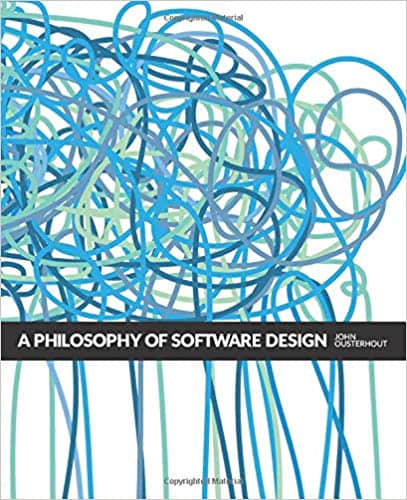

## 前言

从写上一篇博客到现在，不知不觉竟然已经过了快一年的时间。忙碌了快一年，终于稍微有点空闲的时间重新开始写作，于此同时，我也回顾了一下去年写作的一些选题，反思之后，我希望今年能够多写一些更有深度的内容。因此也有了这篇文章的诞生。

这篇文章不能算作算是完全原创的内容，而是汲取了干货之后外加个人吸收所产生的一些想法。请不要因为不是原创就没有耐心读下去，因为本篇文章的知识来源的确是难得的宝藏。下面，就请随我一同，汲取来自 **[A Philosophy of software design](https://www.amazon.com/Philosophy-Software-Design-John-Ousterhout/dp/1732102201)** 这本书的哲思。

这本书应该是 2018 年我所读过的**最有价值**的一本书，因此书中的内容也非常值得学习和分享。

## 作者简介


这本书的作者是 [John Ousterhout](https://en.wikipedia.org/wiki/John_Ousterhout)，目前是斯坦福大学的计算机系的教授，同时也是大名鼎鼎的 [Raft(著名的分布式算法)](<https://en.wikipedia.org/wiki/Raft_(computer_science)>) 和 [Tcl](https://zh.wikipedia.org/wiki/Tcl) 的发明者。

作者曾经还参与过三个操作系统从零到一的开发，开发过多文件存储系统，许多基础设施工具，比如 debugger，构建系统，GUI 工具库，脚本语言，可交互的文本编辑器等。光是这些 `Title` 和经历都能吓死一般人，不过我们还是以事实说话，来看看他写的这本书到底有何优秀之处。

可惜的是本书刚出不久，只有英文版，因此笔者也是下了很大的精力去研读这本书。

如果没有条件看书的小伙伴，可以在 YouTube 上看一下作者本人在 [Google 内部的演讲](https://www.youtube.com/watch?v=bmSAYlu0NcY), 也能够大概一览本书的风采。

## 写作背景

自从人们开始给计算机写编写程序到现在已经很久了。业界也有很多关于软件开发流程的讨论，比如**敏捷开发 (Agile Development)**。也有很多关于编程工具，比如 debugger，版本控制系统，测试工具的讨论。以及对编程技巧和技术的广泛和深度的分析，比如**面向对象编程 (Object-oriented Programming)**编程和**函数式编程（Functional Programming）**, **设计模式（Design Patterns）**和**算法（Algorithms）**。

但是**软件设计**本身并没有很广泛地被讨论和触及。David Parns 于 1971 年发表的 **[将系统划分为模块的准则 (On the Criteria To Be Used in Decomposing System into Modules)](https://www.win.tue.nl/~wstomv/edu/2ip30/references/criteria_for_modularization.pdf)** 经典论文探讨了一些关于软件设计的基本问题。但是到今天为止，关于软件设计的问题探讨却没有什么明显地进展。

作者认为，计算机科学的最基本的问题是 —— **问题分治**(如何将一个复杂的问题换分成更小的问题以便于独立地解决)。然而在现在世界各地的大学里面，都没有针对这一在软件设计中的核心任务开设课程。学生在大学里能够学到 OOP，但是却没能学到软件设计。

因此作者产生了一些想法:

1. 是什么区分除了伟大的程序员和普通的程序员，是否能够把让他们变得伟大的一些技巧在课堂中教授出去
2. 作者假设伟大的程序员和普通的程序员的鸿沟在于伟大的程序员拥有更好的软件设计技巧
3. 作者想通过实验性地在大学里教授**软件设计**来验证这一观点

这就是本书以及斯坦福 [CS 190](https://web.stanford.edu/~ouster/cgi-bin/cs190-winter18/index.php) 这门课诞生的缘由。这本书也反应了作者的职业生涯中真实经历，以及本书所提及的一些原则和技巧成功地在他的编码生涯中被运用。

作者也指出，希望大家**辩证地进行阅读**，尽情地根据自己的实际经验和情况去深度思考和对比。

> 这里顺便插一句，Jeff Dean 也给作者在写这本书时提供了很多建议和意见，如果你不知道 Jeff Dean 是谁，那就赶紧 Google 一下吧~

---

## 一场对抗复杂度（Complexity）的持久战

编程是人类历史上最纯粹的智力性创造活动。编程不需要任何身体上技巧或者是协调性，不像打篮球和芭蕾那样，编程只需要一颗有创造性的头脑以及如何利用这颗头脑来组织你的想法。那么软件的复杂度从何而来呢？

### 复杂度从何而来

正是应为编程是如此地自由而不受限制，随着程序不断地演进，解决了一个又一个问题，伴随着程序组件之间难以觉察的依赖关系，程序就变得越来越复杂了。

正如[热力学第二定律](https://zh.wikipedia.org/wiki/%E7%83%AD%E5%8A%9B%E5%AD%A6%E7%AC%AC%E4%BA%8C%E5%AE%9A%E5%BE%8B)中对于熵的描述 -- 孤立系统自发地朝着一个平衡的方向不断发展即**最大熵状态**（在这里我们所说的熵指的是信息的熵），软件开发也是如此，随着时间的迁移和对软件的不断修改，程序员将越来越难在脑袋中保存软件的所有关键因素，这就会导致 bug 的产生，降低开发的速度。

对于所有的软件来说，复杂度的逐渐增长是一种不可避免的趋势。程序越庞大越复杂，参与开发的人数越多，复杂度增长的速度以及管理复杂度的难度将变得愈来愈大。因此编写软件最大限制在于**开发者对于自己开发的系统本身的理解**。

好的开发工具可以在一定程度上减轻复杂度，让我们更加便捷和低成本地进行开发，但是我们仍然要找到让软件变得更加简洁的办法，因为简洁的设计能够让我们在复杂度彻底失控之前就构建出强大的系统。

### 如何对抗复杂度

一般来说，主要两种解决复杂度的方法，作者对这两种方法都进行了详尽的讨论：

1. **使代码变得更加简洁和意图明显来对抗复杂度**
2. **使用封装 —— 模块化设计**

本书的核心观点也都是建立在如何降低软件的复杂度上。

### 软件设计是持久战

作者认为软件设计贯穿着软件开发的整个生命周期。这也是为什么现在[瀑布模型](https://zh.wikipedia.org/wiki/%E7%80%91%E5%B8%83%E6%A8%A1%E5%9E%8B)几乎很难正常进行下去，而[敏捷开发](https://zh.wikipedia.org/wiki/%E6%95%8F%E6%8D%B7%E8%BD%AF%E4%BB%B6%E5%BC%80%E5%8F%91)成为如今大多数团队的选择的原因。

因为敏捷开发是一种**增量**的开发方式，而增量式的开发意味着对软件的设计从来不会完全停止，同时，增量开发也意味着持续不断地**重新设计**。

### 如何学习并运用好这本书

- 不断地进行 **Code Review**
- 学会辨认那些会增加软件复杂度的代码或者行为的**特征（Red Flag）🚩**
- 尝试使用**多种方案**来解决上面提到的那些特征
- 不要**极端地（Taking it too far）**使用某条原则，每个原则都有自己例外和限制

### 原则一览

书中讨论的比较重要的软件设计原则有以下几点:

> 这里笔者提供了原英文描述，若有勘误还请指正

1. **复杂度是不断递增的 —— 不要忍受那些看似微小的问题（Complexity is increamental: you have to sweat the samll stuff）**
2. **正常工作的代码是远远不够的（Working code isn't enough）**
3. **持续地累积对软件设计有提升的行为（Make continual small investments to improve system design）**
4. **模块应该是深的（Module should be deep）**
5. **对接口设计应该让那些最通常的用法变得尽量简单（Interfaces should be designed to make the most common usage as simple as possible）**
6. **让模块拥有一个简洁的接口比拥有一个简洁的实现要更重要（It's more important for a module to have a simple interface than a simple implementation）**
7. **通用模块通常更具深度（General-purpose modules are deeper）**
8. **分离处理通用情形和处理特殊情形的代码（Separate general-purpose modules and special-purpose code）**
9. **不同的层应该使用不同的抽象 (Different layers should have different abstractions)**
10. **复杂度下沉 (Pull complexity downward)**
11. **消灭错误 (以及特殊情况)（Define errors (and special cases) out of existence）**
12. **进行二次设计（Design it twice）**
13. **注释应该描述那些在代码中不明显的信息（Comments should describe things that are not obvious from the code）**
14. **软件应该被设计成容易阅读而并非容易实现（Software should be designed for ease of reading, note ease of writing）**
15. **软件开发的增量部分应该是抽象而非特性（The increments of software development should be abstractions, not）**

## 软件复杂度的本质

要想知道如何减少软件的复杂度，首先要知道如何辨认复杂度。而识别出软件中的复杂度也是一项关键的技巧。

### 复杂度的定义

作者是这样定义复杂度的：

> 复杂度是任何与软件系统结构相关的任何东西，它使得系统难以被理解和修改

复杂度可能以很多的形式来呈现，比如系统中的某一块代码难以理解，也可能是不知道要修改系统的哪一部分才能对其改进，亦或是没办法很轻松的修复一个 bug 而不导致其他 bug 的产生，等等。

不过值得注意的是，**复杂的系统并不一定有很高的复杂度**，可能一个系统庞大且有很多复杂的功能，但是却很容易在上面展开工作，那么对于这个系统而言，它**复杂度并不高**。

复杂度由系统中最常见的和活跃的部分决定，如果我们用一个数学表达式来表达系统的综合的复杂度：

$$
C = \sum_{\mathclap{p}} c_pt_p
$$

系统 C 的综合复杂度由系统的每个部分 p ($$c_p$$) 的复杂度和由开发人员在该部分上工作所花费的时间 $$t_p$$ 加权计算而来。

由此可知，即使一个系统有一些部分非常复杂，但是那些部分几乎不需要再被接触，那么它们对整体的系统复杂没有很大的影响。

### 复杂度的症状

复杂度通常以以下三种形式所展现:

1. **修改放大 (Change amplification)** -- 一次看似简单的改动却需要同时修改多个地方
2. **认知负担 (Cognitive load)** -- 为了完成一项任务需要知道很多的信息，比如晦涩难懂的写法，四处分散的全局变量，不一致性，模块之间的互相依赖等
3. **未知的未知数 (Unknown unknowns)** -- 不知道完成某一项任务需要改动代码的哪些部分，或者不知道需要哪些信息才能够完成一个任务

在上面三种症状中，**未知的未知数**是最为严重的，因为这意味着，有些事情你必须了解才能正确地完成某个任务，但是你却不知道要如何了解这些事情，又或者是这些事情背后有什么隐情（或许是一些历史包袱）。

而前面两者是相对来说比较好解决的，或者说是烦人但却不至于严重影响工作。所以产出好的设计的一个重要的目标就是让系统变得**明显和易于理解**。

### 产生复杂度的原因

一般来说，复杂度主要由**不正常的依赖 (Dependenices)**和**信息晦涩 (Obscurity)**所导致。**依赖**本身作为软件开发最重要的元素之一，是不可能被完全剔除的，因此对于软件设计来说，主要的目的便是使依赖变得清晰和简洁。对于**信息晦涩**而言，体现的方面就更多了，比如变量名起得过于通俗，缺少文档，隐式依赖等。这些细节会在之后的设计原则中详细地讨论。

### 复杂度小结

复杂的系统就像罗马一样，不是一蹴而成的，常常是由微小的复杂的部分积累而来。开发者若是经常抱着 "影响很小的，没关系的" 这样地心态来进行每一次变更，那么很快，系统的复杂度将不受限制地增长。而修复一个不正常的依赖和解决一个信息晦涩的问题，则会有所不同。为了限制复杂度的增长，我们应该采取**零容忍**的哲学，让未来变得 💪 更好。

---

接下来，我们就进入正题，来看看书中强调的这些软件设计原则

## NO.1 正常工作的代码是远远不够的（Working code isn't enough）

这个一条原则说的是开发人员在执行一个编程任务时的**心态**。很多公司或者组织鼓励一种战术性的心态 —— **专注于快速实现功能**。

然而，如果你追求的是一个良好的软件设计，那么你必须付出额外的时间来产出一个具有更好设计的实现的心态。

### 战术性编程 (Tactical Programming)

大部程序员采取的都是一种叫做**战术性编程**的思想状态，专注于实现功能或者修复 bug。然而战术性编程的问题在于经常会让开发者变得**短视**。结果，可能是为了赶上 DDL 或者尽快地完成任务而说服自己加入一些产生复杂度的代码或者是使用拼凑出来的解决方案，然而这样却会使得系统更快地变得复杂，尤其是开发这个系统的所有人都采取这样的思路的时候。

过不了多久，之前埋下的恶果开始导致一些问题，然后开发者便会开始后悔当初走了捷径。

**一旦你采取了战术性编程的思想，往往很难再停下来了。**

### 策略性编程 (Strategic Programming)

成为一个更好的程序设计者的第一步就是要意识到：**仅仅只能正常工作的代码是远远不够的**。最重要的事情应该是系统的长远的结构。

所以你的首要任务应该是产出一个良好的设计，并且在持续在工作中投入一定的时间来进行设计。这些投入可能从短期上来看会降低你的开发速度，但是从长期来看却可以让你更加迅速无阻地开发。

当然，不论你预先投入了多少时间在设计上面，错误依旧是不可避免的。所以你还需要继续投入时间来修复这些问题，并且不断地贡献一些小的优化，这样系统才能持续地保持复杂度在一个较能接受的水平。

### 权衡投入


那么可能有人要问了，我需要投入多少额外的时间才算合理呢？巨大的提前投入，比如设法一次性设计整个系统，往往效果不好，这就像瀑布模型一样。理想的的设计趋向于不断地吸收微小的部件和变动，因此不断地对系统设计进行投入才是合理之道。

一般来说，投入 **10% - 20%** 总开发时间是比较理想的，当这个系统开发地足够久了，这些设计投入会看起来微不足道，但是系统从中获得的好处确实无法衡量的。同时，你多投入的这些时间很快会给予你会报，为你之后的开发节省大量的时间。

反而言之，如果你一直采取战术性编程，那么很快你的开发速度就会慢下来，并且越来越慢，最后你一开始剩下来的那点时间也变得微不足道了。

### 原则小结

良好的软件设计是需要付出代价的。所以它应该是你需要持续投入的东西，这样，微小的问题才不会一直积累成巨大的雪球直到压垮你的系统。

幸运的是，好的设计总会回馈给你，并且比你想象得要快。所以请把它当做今天就要做的任务，而不是推迟到明天，后天，或者大后天，因为你等待得越久，你面临的问题就会更严峻。

## NO.2 模块应该是深的 (Modules Should be Deep)

**模块化设计**是管理系统复杂度的重要技巧之一，模块化设计使得开发者只需要面对系统综合复杂度的其中一小部分。

模块化设计可以是不同形式的，比如**类（clasess）**，**子系统（subsystems）**，或者**服务（services）**。在理想世界当中，每个模块都完全互相独立，不依赖与对方。然而在现实世界，这是无法做到的。模块必须要组合在一起，以调用其他模块的函数或者方法，模块与模块之间必须要知道对方的存在这就是模块之间的依赖。

**模块依赖**的形式也可以有很多种，并且也可以是难以察觉的依赖。而模块化设计的目标也是尽可能地降低模块之间的依赖。

### 关于模块

为了更好地管理依赖，我们将模块看作两部分：**接口（interface）**和**实现（implementation）**。接口描述了该模块的目的以及模块如何达成该目的，而实现则是由实现该模块承诺的代码组成的。

对于本书的目的而言，**模块可以是任何包含接口和实现的代码单元**，比如任何 OOP 编程语言中的类，或者类中的方法，非 OOP 变成语言中的函数，乃至是更高层级的子系统或者服务（他们的接口呈现出不同的形式，比如内核调用，发送 HTTP 请求等），都可以看作是模块。

### 接口里有什么

一个模块的接口里，包含了两种类型的信息：**正式（formal）**的和**非正式的（informal）**

正式的信息通常在代码中显式地指定了，比如一个方法的**签名（signature）**（包含了名称，参数，返回值，可能抛出的异常等）。而每个接口也包含了一些非正式的元素，比如使用的场景限制，调用顺序等，都是接口的一部分。

通常来说，如果一个开发者需要知道一些特定的信息才能够使用某个模块，那么这个信息就属于模块接口的一部分，而非正式的信息只能够通过注释来描述。对于大部分模块来说，接口的非正式信息部分要比正式信息的部分要更大，更复杂。

### 抽象（Abstractions）

抽象和模块化设计是紧密关联的。**抽象是一个实体的简洁的展现，它忽略了不重要的细节。**

在模块化编程当中，每个模块都以接口的形式提供了一个抽象。对于模块的抽象而言，其实现是不重要的信息。**而抽象忽略的不重要的信息越多越好**。

抽象往往容易走向错误的方向，常见的错误有两种：

- 包含了不重要的细节 —— 使得抽象更加复杂
- 忽略了重要的细节 —— 使得信息晦涩，使得开发者难以理解和正确地运用该抽象

**设计抽象的关键在于理解什么是重要的信息，并且寻找一种可以最小化这种重要信息的设计。**

其实，我们不仅依靠在编程中依赖抽象来管理软件复杂度，抽象在日常生活中也无处不在。比如，汽车提供了一个足够简单的抽象让我们去驾驶它而不需要学习任何关于马达，能量管理，防抱死制动器，恒速操纵器等的知识。

### 深模块 (Deep Modules)

**最好的模块是那些既提供了强大功能但又有着简单接口的模块。**

> 作者用 deep 这个词来形容这样的模块，笔者将其翻译为深模块

如果我们要视觉化 “**深度（depth）**” 这个概念，请把每个模块想象成一个矩形。矩形的面积代表的就是模块所实现的功能，矩形顶部的边缘代表着模块的接口。边缘的长度越短，代表接口的复杂度越低。


模块的深度也是一种思考代价和好处的方式。一个模块所能提供好处来自于它提供的功能，而代价（对于系统复杂度而言），便是它的接口。**一个模块的接口代表着这个模块给系统的所带来的复杂度 —— 更小更简洁的接口带来的复杂度更低。**

接口本身是好的，但是更多，更大更复杂的接口并不意味着更好。

Linux 中负责文件 I/O 的模块，就是一个深模块的很好的例子。一共只有五个最基本的 I/O 系统调用，并且都有简介的签名：

```c
int open(const char* path, int flags, mode_t permissions);
ssize_t read(int fd, void* buffer, size_t count);
ssize_t write (int fd, const void* buffer, size_t count);
off_t lseek(int fd, off_t offset, int referencePosition);
int close(int fd);
```

`open` 系统调用接受一个分层级的文件名， 比如 `/a/b/c` 然后返回一个整形的文件描述符（file descriptor）作为打开的文件的引用。其他的参数为 `open` 提供了可选的信息，比如打开文件时是用于读还是写，是否在打开一个不存在的文件时直接创建，以及创建文件时的访问权限等。`read` 和 `write` 系统调用则在缓冲区传输信息，`close` 结束文件的访问。大多数文件是按照顺序访问，所以这个行为是默认的，但是随机访问也可以通过调用 `lseek` 这个系统调用来改变当前访问的位置。

现代 Unix 操作系统的 I/O 接口需要成百上千行代码，都是为了解决类似这些问题:

- **如何将文件在磁盘上表示，以便于更加高效的访问？**
- **目录是如何存储的，分层级的路径名是如何进行处理并定位到某个文件的？**
- **文件权限是如何保证的，这样用户才无法删除其他用户的文件？**
- ...

这些问题，甚至更多，都在 Unix 的文件系统的实现中处理了。他们对于使用这些系统调用的程序员来说是不敏感的。Unix I/O 的接口的实现这些年已经变化地很彻底了，但是这五个最基本的内核调用却没有改变。

**像这样的深模块，易于使用，但是却隐藏了绝大的实现上的复杂度。**

### 浅模块（Shallow modules）🚩

另一方面，**浅模块是那些其接口相对于其提供的功能更复杂的模块**。比如，一个实现**链表（Linked List）**的类是浅模块。操作链表的实现不需要很多代码（插入，删除一个元素只需要几行代码），所以链表的抽象并没有隐藏很多的细节，其接口的复杂度几乎和它实现的复杂度一样。

浅类有时候是无法避免的，但是它们对管理软件复杂度来说，提供不了什么帮助。

### 皆可 "类"（Classitis）

不幸的是，深类的价值在今天并不被广泛地接受。传统的编程观点认为，类必须要小（small），而不是深（deep）。可能你还会经常听到这样的观点: “任何超过 N 行的方法都必须要被拆分成不同的方法”。这种做法会导致产生大量的浅方法和浅类，然后系统整体增加复杂度。

因此作者给这种极端地 **“类必须要要小（Class should be samll）”** 的做法，起名为 **"Classitis"**, 而这种做法来源于 **“类非常好，越多的类越好（Classes are good, so more classes are better）”** 的错误想法。

### 原则小结

通过分离模块的接口和实现，我们能够将实现的复杂度对系统的其他部分隐藏起来。模块的用户只需要理解接口所提供的抽象就可以了。因此，在设计类和方法的时候，最终要的事情便是让他们变得深，给普遍的用例提供简单的接口，但依旧提供重要的功能。

## No.3 信息隐藏和泄露（Information Hidding and Leakage）

在上面一条原则中，我们理解了为什么模块应该要深，本条原则则讨论的是创建深模块的一些技巧。

### 信息隐藏（Information hidding）

实现深模块的重要技术之一便是使用**信息隐藏**。这个技术的基本思想是：**每个模块应该封装一些提现设计决策的信息**。这些信息植入在模块的实现当中而不会出现在模块的接口里，因此对其他模块不可见。

这些隐藏的信息通常包含了模块的实现机制的细节，比如：

- **如何在 B 树种存储数据并且高效地地对数据进行访问**
- **如何确定一个文件的物理磁盘区块（physical block）和逻辑区块（logical block）的对应关系**
- **如何实现 TCP 网络传输协议**
- ...

这些隐藏的信息可以包含和模块实现有关的数据结构和算法，也可以包含一些高阶的抽象概念，约定俗成等，比如推测该模块通常情况下操作的都是小文件。

信息隐藏主要从两个方面减少复杂度：

1. 通过简化模块的接口，减少使用该模块的开发者的认知负担 (比如，使用 B 树的人通常不需要关心数据的存储形式)
2. 信息隐藏便于系统的升级，模块外部对改模块隐藏的信息没有依赖关系，那么对与该模块隐藏信息的变更将不会影响系统的其他部分 (比如，TCP 协议的拥塞机制的变更，通常不会隐藏高层代码的变更)

因此，在设计一个新模块的时候，应该认真思考什么信息应该被隐藏在模块之中，如果你能够隐藏更多的信息，那么你便能使得模块结构变得更简洁，并且让模块变得更深。

> 注意：在支持 OOP 的编程语言中，使用 **private** 关键字来隐藏方法和变量，不能算是信息隐藏。（可以思考一下为什么）

### 信息泄露（Information Leakage）🚩

与信息隐藏对立的便是信息**泄露**。信息泄露通常出现在**设计决策同时被多个模块影响的时候**。
