## 前言

Vue.js 对我来说可以说是非常重要也非常熟悉的一个前端框架，我也一直想抽时间写一个关于 Vue 的原理的解读系列

废话不多说，马上进入此篇文章的重点 `虚拟 DOM` 和 `Diff 算法`

## 为什么以这个内容作为开题

很多人都在谈论 Virtual DOM，但是 Virtual DOM 真正的意义在哪里？仅仅是为了提高原本 DOM 操作的效率吗，还是如何？

我觉得这个内容能够很好地解释现代前端框架的诞生，以及它们背后真正所蕴含的思想

同时，它也是 Vue 最重要的组成部分之一

## 什么是 Virtual DOM

顾名思义 Virtual DOM 是我们对真实 DOM 的模拟，DOM 也有自己的数据类型，我们使用 JavaScript 中的对象就可以简单地模拟出 `Node` 的属性与方法，操作虚拟 DOM 就好像在操作真实的 DOM 一样，只不过我们把它叫做 `Virtual Node` 简称 `VNode`

下面是一个 `VNode` 的简单例子：

```js
class VNode {
  constructor({ el, data, children, text, key }) {
    // 选择器，或者对应的真实 DOM 节点
    this.el = el;
    // VNode data
    this.data = data;
    // 子节点
    this.children = children;
    // 文本节点
    this.text = text;
    // key
    this.key = key;
    // ...
  }
}
```

假如我们有以下的 DOM 结构:

```html
<div>
  <span>some text</span>
</div>
```

用 `VNode` 可以表述为：

```js
new VNode({
  el: 'div',
  children: [
    new VNode({
      el: 'span',
      text: 'some text',
    }),
  ],
});
```

以上只是一些非常简单的例子，真实的 VNode 的结构是非常复杂的，不过不要紧，接下来我们就一步一步地深入 `Vue.js` 中的 `VNode` 实现

## 不得不提的 Snabbdom

[Snabbdom](https://github.com/snabbdom/snabbdom) 是一个 Virtual DOM 的库，简洁，模块化的同时又有很强大的功能和良好的性能

> Virtual DOM is awesome. It allows us to express our application's view as a function of its state —— snabbdom

Snabbdom 的简介很形象地描述了 VDOM 的价值所在，它把应用程序(web)的视图层看作是某函数将其状态(state)映射出来的结果

如果我们用一个表达式来形容，那就是: `fn(state) => view`，这里的 `fn` 可以为任意的函数

我们甚至可以理解为 `Vue(state) => view` 或者 `React(state) => view` 以及 `Angular(state) => view`

而不同的 `fn` 自有不同的实现，其中，`VDOM` 可以更好地帮助我们进行状态(state)的转化

---

而 Vue 的 VDOM 的实现则来自于 `Snabbdom`，因此，我也选择用 `Snabbdom` 来进行分析

### Snabbdom 简介

Snabbdom 非常地简洁，其核心代码只有大约 200 行，并且支持可扩展性良好

它拥有一个模块化的结构，允许自定模块，而为了保持核心部分的简洁，所有非必要的功能都统一代理给了模块来实现

与此同时 Snabbdom 还拥有很不错的性能

### 代码结构

```bash
├── h.ts 创建 VNode
├── helpers
│   └── attachto.ts
├── hooks.ts 生命周期/钩子
├── htmldomapi.ts DOM API 映射
├── is.ts
├── modules 模块代码
│   ├── attributes.ts
│   ├── class.ts
│   ├── dataset.ts
│   ├── eventlisteners.ts
│   ├── hero.ts
│   ├── module.ts
│   ├── props.ts
│   └── style.ts
├── snabbdom.bundle.ts
├── snabbdom.ts 核心代码
├── thunk.ts
├── tovnode.ts 转换真实 DOM 节点至 VNode
└── vnode.ts VNode 定义
```

接下来我会对主要一些的模块进行解析

### VNode 定义

首先我们来看看 Snabbdom 是如何诠释 VNode 的

```ts
export interface VNode {
  sel: string | undefined;
  data: VNodeData | undefined;
  children: Array<VNode | string> | undefined;
  elm: Node | undefined;
  text: string | undefined;
  key: Key | undefined;
}
```

Snabbdom 中的 VNode 只是一个普通的 `plain object`

其中主要包含 `sel`, `data`, `children`, `elm`, `text`, `key` 几个属性

其中，`data` 属性又有其单独的定义

```ts
export interface VNodeData {
  props?: Props;
  attrs?: Attrs;
  class?: Classes;
  style?: VNodeStyle;
  dataset?: Dataset;
  on?: On;
  hero?: Hero;
  attachData?: AttachData;
  hook?: Hooks;
  key?: Key;
  ns?: string; // for SVGs
  fn?: () => VNode; // for thunks
  args?: Array<any>; // for thunks
  [key: string]: any; // for any other 3rd party module
}
```

是不是看起来很眼熟了，`dataset`, `class`, `style`，这些都是对真实 DOM 节点的模拟映射

而创建 `vnode` 的代码也非常简单：

```ts
export function vnode(
  sel: string | undefined, // selector 的缩写，代表元素选择器
  data: any | undefined, // 构造 DOM 节点所需要的数据属性
  children: Array<VNode | string> | undefined, // 子 vnode 数组
  text: string | undefined, // 如果是文本节点，这个属性才会有值
  elm: Element | Text | undefined
): VNode {
  // 构造 DOM 节点后保存的节点引用

  let key = data === undefined ? undefined : data.key;

  return {
    sel: sel,
    data: data,
    children: children,
    text: text,
    elm: elm,
    key: key,
  };
}
```

创建 VNode 的方法是一个相当简单的 `factory function`

你可能会想，为什么我们不用 `Class` 或者 `Constructor` 来实现呢，这是因为 Snabbdom 追求精简的实现，避免刻意使用 OOP 所产生的副作用

> But existing solutions were way way too bloated, too slow, lacked features, had an API biased towards OOP and/or lacked features I needed

### 模块(Module)和钩子(Hook)

#### 钩子 Hook

在 Snabbdom 中，最重要的部分就是模块和钩子(也可以称作是生命周期)

钩子定义了 VNode 从创建到更新到销毁整个过程中所经历的特殊时间点，在这些时间点上，我们可以触发对应的钩子函数以达到某种目的

Snabbdom 分别定义了以下几个钩子：

```ts
export interface Hooks {
  pre?: PreHook;
  init?: InitHook;
  create?: CreateHook;
  insert?: InsertHook;
  prepatch?: PrePatchHook;
  update?: UpdateHook;
  postpatch?: PostPatchHook;
  destroy?: DestroyHook;
  remove?: RemoveHook;
  post?: PostHook;
}
```

这些钩子默认情况下都是一些空函数，而模块(Module)则利用这些钩子实现了各种强大的功能

#### 模块 Module

模块其实就是特殊的钩子函数的集合

Snabbdom 中的模块都是在某些特定的钩子里触发模块所对应的操作

还记得先前的目录结构吗？Snabbdom 提供了一些默认的模块，足够我们操作 DOM 节点的各方面

```bash
├── modules 模块代码
│   ├── attributes.ts 操作属性的模块
│   ├── class.ts 操作 class 的模块
│   ├── dataset.ts  操作 dataset 的模块
│   ├── eventlisteners.ts 操作事件的模块
│   ├── hero.ts 某个展示特定动效的模块(用于 example 展示，可不用理会)
│   ├── module.ts 模块的定义
│   ├── props.ts 操作 props 的模块
│   └── style.ts 操作 style 的模块
```

模块的定义也非常简单，它是包含部分钩子的一个对象

```ts
import {
  PreHook,
  CreateHook,
  UpdateHook,
  DestroyHook,
  RemoveHook,
  PostHook,
} from '../hooks';

export interface Module {
  pre: PreHook;
  create: CreateHook;
  update: UpdateHook;
  destroy: DestroyHook;
  remove: RemoveHook;
  post: PostHook;
}
```

而 Snabbdom 核心部分调用这些模块的方式也非常地巧妙，不过我们首先来看几个模块的具体实现

##### Props 模块

`props` 属性对应的是 DOM 节点上的直接属性，比如 `scrollTop`, `offsetWidth` 这样的属性

```ts
/* props 模块的实现 */
function updateProps(oldVnode: VNode, vnode: VNode): void {
  var key: string,
    cur: any,
    old: any,
    elm = vnode.elm,
    oldProps = (oldVnode.data as VNodeData).props,
    props = (vnode.data as VNodeData).props;

  if (!oldProps && !props) return;
  if (oldProps === props) return;
  oldProps = oldProps || {};
  props = props || {};

  for (key in oldProps) {
    if (!props[key]) {
      // 将原本不存在与新 VNode 中的 prop 去除
      delete (elm as any)[key];
    }
  }
  // 重新在对应 DOM 节点上设置 props
  for (key in props) {
    cur = props[key];
    old = oldProps[key];
    // 需要针对 value 属性做特殊处理
    if (old !== cur && (key !== 'value' || (elm as any)[key] !== cur)) {
      (elm as any)[key] = cur;
    }
  }
}

/* 如果加载了 Props 模块，那么在 create 和 update 钩子中，都会调用该模块 */
export const propsModule = {
  create: updateProps,
  update: updateProps,
} as Module;
```

##### Dataset 模块

`dataset` 属性对应的是 DOM 节点上的自定义 data 属性 `data-*`

```ts
const CAPS_REGEX = /[A-Z]/g;

function updateDataset(oldVnode: VNode, vnode: VNode): void {
  let elm: HTMLElement = vnode.elm as HTMLElement,
    oldDataset = (oldVnode.data as VNodeData).dataset,
    dataset = (vnode.data as VNodeData).dataset,
    key: string;

  if (!oldDataset && !dataset) return;
  if (oldDataset === dataset) return;
  oldDataset = oldDataset || {};
  dataset = dataset || {};
  const d = elm.dataset;

  for (key in oldDataset) {
    // 除不在新的 VNode 当中的 dataset 属性
    if (!dataset[key]) {
      if (d) {
        // 如果 node 有 dataset 对象，则直接删除改属性
        if (key in d) {
          delete d[key];
        }
      } else {
        // 否则使用 removeAttribute 接口
        // 转换大写属性为 camel-case
        elm.removeAttribute(
          'data-' + key.replace(CAPS_REGEX, '-$&').toLowerCase()
        );
      }
    }
  }
  /* 同理设置更新 VNode 对应 DOM 节点的 dataset 属性 */
  for (key in dataset) {
    if (oldDataset[key] !== dataset[key]) {
      if (d) {
        d[key] = dataset[key];
      } else {
        elm.setAttribute(
          'data-' + key.replace(CAPS_REGEX, '-$&').toLowerCase(),
          dataset[key]
        );
      }
    }
  }
}

// 和 props 模块一样，在触发 create 和 update 钩子时都会调用
export const datasetModule = {
  create: updateDataset,
  update: updateDataset,
} as Module;
```

我们主要就挑选了这两个模块来进行分析，至于其他的模块，也是大同小异

重要的是，我们通过上面这两个例子可以看出**模块**和**钩子**之间的关系

### h 函数

`h` 这个名字可能会让很多人都感到迷惑，其实它是 `hyperscript` 的缩写，在各类的 `virtual-dom` 的实现中广泛地使用

> "Hyperscript" itself stands for "script that generates HTML structures" —— Evan You

而 `hyperscript` 本身代表了**能生成 HTML 结构的脚本**，因为 `HTML` 本身也是 `hyper-text markup language` 的缩写

这个说法的出处最早来自于 Github 上一个叫做 [Hyperscript](https://github.com/hyperhype/hyperscript) 的仓库，它甚至还有自己的一个[生态系统](https://github.com/hyperhype/hyperscript#ecosystem)

h 函数在 snabbdom 中便是用来生成 VNode 的:

```ts
export function h(sel: string): VNode;
export function h(sel: string, data: VNodeData): VNode;
export function h(sel: string, children: VNodeChildren): VNode;
export function h(sel: string, data: VNodeData, children: VNodeChildren): VNode;
export function h(sel: any, b?: any, c?: any): VNode {
  var data: VNodeData = {},
    children: any,
    text: any,
    i: number;
  // @important 要么存在 children, 要么存在 text
  if (c !== undefined) {
    data = b;
    if (is.array(c)) {
      children = c;
    } else if (is.primitive(c)) {
      text = c;
    } else if (c && c.sel) {
      children = [c];
    }
  } else if (b !== undefined) {
    if (is.array(b)) {
      children = b;
    } else if (is.primitive(b)) {
      text = b;
    } else if (b && b.sel) {
      children = [b];
    } else {
      data = b;
    }
  }
  // ...
  return vnode(sel, data, children, text, undefined);
}
export default h;
```

值得注意的是，一个 `vnode`，要么拥有多个子节，要么就是一个文本节点 (两者不会冲突)

### Snabbdom Core

接下来我们就要开始进入 Snabbdom 的核心方法当中，借此来探寻，整个虚拟 DOM 从创建到销毁的声明周期

Snabbdom 的核心是 `init` 方法，该方法接收一个数组，数组的成员是 Snabbdom 模块的实例，然后 Snabbdom 会对这些模块进行初始化，最终返回一个 `patch` 方法:

```ts
var snabbdom = require('snabbdom');
var patch = snabbdom.init([
  // Init patch function with chosen modules
  require('snabbdom/modules/class').default, // makes it easy to toggle classes
  require('snabbdom/modules/props').default, // for setting properties on DOM elements
  require('snabbdom/modules/style').default, // handles styling on elements with support for animations
  require('snabbdom/modules/eventlisteners').default, // attaches event listeners
]);
```

然后利用我们之前提到的 `h` 方法来创建 VNode，然后用 `patch` 来生成真实的 DOM 节点:

```ts
var h = require('snabbdom/h').default; // helper function for creating vnodes

var container = document.getElementById('container');

var vnode = h('div#container.two.classes', { on: { click: someFn } }, [
  h('span', { style: { fontWeight: 'bold' } }, 'This is bold'),
  ' and this is just normal text',
  h('a', { props: { href: '/foo' } }, "I'll take you places!"),
]);
// Patch into empty DOM element – this modifies the DOM as a side effect
patch(container, vnode);
```

我们大致已经了解了 Snabbdom 的用法，现在我们就顺藤摸瓜，看看 `init` 方法里都做了些什么

#### 初始化模块

由于不同模块之间可能会有同样的钩子，所以第一步就是将所有使用的模块的钩子都统一起来，便于稍后按次序执行：

```ts
import htmlDomApi, { DOMAPI } from './htmldomapi';

const hooks: (keyof Module)[] = [
  'create',
  'update',
  'remove',
  'destroy',
  'pre',
  'post',
];
// ...
export function init(modules: Array<Partial<Module>>, domApi?: DOMAPI) {
  let i: number,
    j: number,
    cbs = {} as ModuleHooks;
  // 创建用于操作 DOM 的 API 对象
  const api: DOMAPI = domApi !== undefined ? domApi : htmlDomApi;

  // 这里就将模块的钩子函数统一都存储到一个叫做 `cbs` 的对象上
  // 形如 { create: [ createFnFromAModule, createFnFromBModule ], ... }
  for (i = 0; i < hooks.length; ++i) {
    cbs[hooks[i]] = [];
    for (j = 0; j < modules.length; ++j) {
      const hook = modules[j][hooks[i]];
      if (hook !== undefined) {
        (cbs[hooks[i]] as Array<any>).push(hook);
      }
    }
  }
}
```

#### Patch 方法

初始化模块之后，就可以直接返回 `patch` 方法：

首先，先调用 `pre` 这个钩子：

```ts
// 接上方 init 方法
return function patch(oldVnode: VNode | Element, vnode: VNode): VNode {
  let i: number, elm: Node, parent: Node;
  // 用来存储所有需要插入的 Vnode，便于后续钩子使用
  const insertedVnodeQueue: VNodeQueue = [];
  // 调用钩子
  for (i = 0; i < cbs.pre.length; ++i) cbs.pre[i]();
  // ...
};
```

然后检查第一个参数是否是 vnode, 如果不是，则对它创建一个空的 vnode:

```ts
// 接上方 patch 方法
if (!isVnode(oldVnode)) {
  oldVnode = emptyNodeAt(oldVnode);
}
```

然后比较 `patch` 方法的旧新两个 VNode，如果是同一个 Vnode，则执行更新节点的方法 —— `patchVnode`(这里就涉及到了 Diff 算法，稍后会讲到)

```ts
// ... 接上方
// 如果两个 vnode 相同
if (sameVnode(oldVnode, vnode)) {
  // 执行更新节点的操作
  patchVnode(oldVnode, vnode, insertedVnodeQueue);
}
// ...
```

值得一提的是，Snabbdom 对于相同 vnode 的定义较为简单, 只要满足 `key` 和 `sel(选择器)` 都相同即可:

```ts
function sameVnode(vnode1: VNode, vnode2: VNode): boolean {
  return vnode1.key === vnode2.key && vnode1.sel === vnode2.sel;
}
```

否则，说明两个 Vnode 完全不相同，直接利用新的 Vnode 创建对应的真实 DOM 节点，然后移除旧的 Vnode 所代表的真实 DOM 节点

```ts
// ...
if (sameVnode(oldVnode, vnode)) {
  // ...
} else {
  elm = oldVnode.elm as Node;
  parent = api.parentNode(elm);

  // 否则根据 vnode 创建新的真实 DOM 节点
  createElm(vnode, insertedVnodeQueue);

  if (parent !== null) {
    // 插入并替换原有 DOM 节点
    api.insertBefore(parent, vnode.elm as Node, api.nextSibling(elm));
    removeVnodes(parent, [oldVnode], 0, 0);
  }
}
// ...
```

这里要暂停一下， `api.insertBefore` 是什么？

还记得 `init` 方法开头的 `const api: DOMAPI = domApi !== undefined ? domApi : htmlDomApi;` 吗？

默认情况下，Snabbdom 使用的是 `htmlDomApi.ts` 这个这个文件里定义的 API:

```ts
// ...
function createElement(tagName: any): HTMLElement {
  return document.createElement(tagName);
}

export const htmlDomApi = {
  createElement,
  // ...
} as DOMAPI;

export default htmlDomApi;
```

这样我们就明白了，Snabbdom 将操作 DOM 的 API 接口做了一层抽象，并且允许用户使用自定义的 API 接口，当然默认使用的是和浏览器环境一致的 API 接口

那么，有人可能会疑惑，为什么要这么做呢？

这就是 Vnode 的好处之一了，通过对节点的抽象，以及操作节点的 API 的抽象，Vnode 就可以在不同的平台上发挥一样的作用，达到 `platform agnostic`

只需要提供对应平台的精确的 `Node` 对应 Vnode 的定义，以及该平台上操作 `Node` 的 API 即可：


不依赖平台的 Vnode 就可以做很多的事情了，比如前后端同构，跨平台开发等等...

因此，有人也把 VDOM 称作新的 IR (intermediate representation)

> An intermediate representation is a representation of a program part way between the source and target languages. A good IR is one that is fairly independent of the source and target languages, so that it maximizes its ability to be used in a retargetable compiler.

好了，我们回到原先的主题，在上述操作都执行完之后，最后还要执行两个钩子：

一个是我们任何执行插入操作的节点的 `insert` 钩子

一个是执行完所有操作的 `post` 钩子

```ts
// ...
// 必须要等到所有的节点都插入完成之后才执行 insert 钩子
for (i = 0; i < insertedVnodeQueue.length; ++i) {
  (((insertedVnodeQueue[i].data as VNodeData).hook as Hooks).insert as any)(
    insertedVnodeQueue[i]
  );
}
// 最后执行 post 钩子
for (i = 0; i < cbs.post.length; ++i) cbs.post[i]();
// ...
```

最后，将新的 Vnode 节点返回：

```ts
return vnode;
```

### PatchVnode

刚刚我们分析完了整个 `patch` 方法，但是里面最重要的 `patchVnode` 被我们遗漏了

这个方法才是真正的 Vnode 的比对和更新所发生的地方，这个方法也比较简单，就不仔细分析了，看注释和代码就能很好地理解：

```ts
function patchVnode(
  oldVnode: VNode,
  vnode: VNode,
  insertedVnodeQueue: VNodeQueue
) {
  let i: any, hook: any;
  if (
    isDef((i = vnode.data)) &&
    isDef((hook = i.hook)) &&
    isDef((i = hook.prepatch))
  ) {
    // 执行 prepatch 钩子
    i(oldVnode, vnode);
  }

  // 保存旧 vnode 的 DOM 引用
  const elm = (vnode.elm = oldVnode.elm as Node);
  let oldCh = oldVnode.children;
  let ch = vnode.children;

  // 如果两个节点是同一个对象，则无需 patch
  if (oldVnode === vnode) return;
  // 执行 update 钩子
  if (vnode.data !== undefined) {
    for (i = 0; i < cbs.update.length; ++i) cbs.update[i](oldVnode, vnode);
    i = vnode.data.hook;
    if (isDef(i) && isDef((i = i.update))) i(oldVnode, vnode);
  }

  // 如果新的 vnode 节点不是一个文本节点
  if (isUndef(vnode.text)) {
    // 如果两个 vnode 节点都有子节点
    if (isDef(oldCh) && isDef(ch)) {
      // @important 并且子节点不一样，开始 diff
      if (oldCh !== ch)
        updateChildren(
          elm,
          oldCh as Array<VNode>,
          ch as Array<VNode>,
          insertedVnodeQueue
        );
    } else if (isDef(ch)) {
      // 如果只有新的 vnode 有子节点，设置旧的 vnode 的内容为空
      if (isDef(oldVnode.text)) api.setTextContent(elm, '');
      // 添加插入新的 DOM 节点
      addVnodes(
        elm,
        null,
        ch as Array<VNode>,
        0,
        (ch as Array<VNode>).length - 1,
        insertedVnodeQueue
      );
    } else if (isDef(oldCh)) {
      // 如果只有旧的 vnode 有子节点，则移除所有子节点
      removeVnodes(
        elm,
        oldCh as Array<VNode>,
        0,
        (oldCh as Array<VNode>).length - 1
      );
    } else if (isDef(oldVnode.text)) {
      // 如果旧 vnode 是个文本节点，并且新 vnode 也没有子节点，则清空旧 vnode 的内容
      api.setTextContent(elm, '');
    }
  } else if (oldVnode.text !== vnode.text) {
    // 如果新的 vnode 节点是文本节点，如果文本内容和旧 vnode 不一样则设置新的值
    api.setTextContent(elm, vnode.text as string);
  }

  // 调用 postpatch 钩子
  if (isDef(hook) && isDef((i = hook.postpatch))) {
    i(oldVnode, vnode);
  }
}
```

### updateChildren —— 实现 Diff 算法的地方

在开始分析 diff 之前，我们要清楚地知道一件事情，Snabbdom 中的 vnode 的 patch 只会发生在同一层级，不会跨层级进行

这是因为，如果需要跨层级进行比对，diff 算法的时间复杂度可达到 O(n^3)

为啥时间复杂度是 O(n^3)：

> 我们可以把 diff 算法看作要合并两棵树 A 和 B 然后生成一棵新的树，那么要首先寻找子树, 从 A 树的根节点开始，然后从 B 树的根节点找起，同时遍历两棵树，看看两者是否相同，如果有不一样的，那么从 B 树的根节点的子节点再次遍历比较。假设 B 树的节点数为 N， 那么复杂度为 N^2)。假设 A 树的节点数为 M，那么遍历树 A 和树 B 的复杂度为 M \* N^2，假设 M 约等于 N，那么总的复杂度为 O(N^3)

这样的算法性能是无法接受的，所以只进行同层比较的话，diff 算法的时间复杂度就变为了 O(n)，相对来说也比较高效了

假设我们现在从根节点开始 diff, 如下图所示：

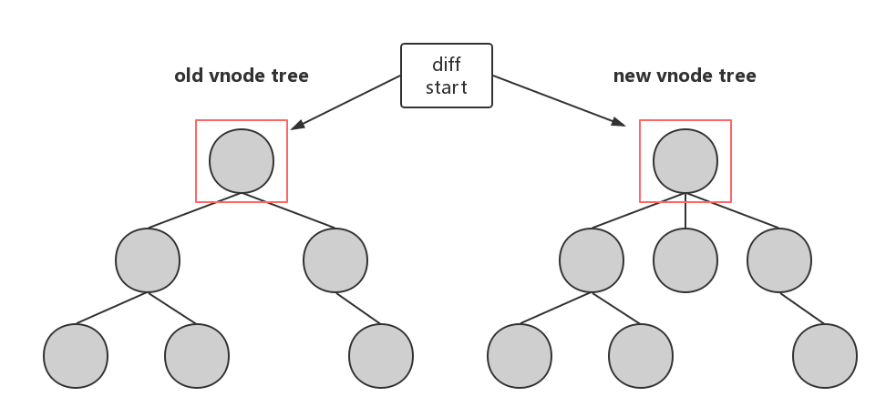

之后的 diff 也是按照同层级相比较，如下图所示：

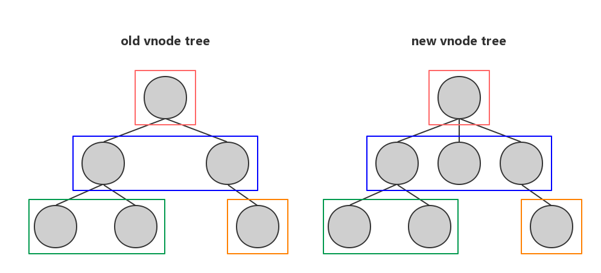

相同颜色的代表互相进行比较的节点，它们都是同一层级的

了解了这个之后，我们可以开始来讨论 Snabbdom 的 diff 算法了，这个算法会给新旧 vnode 的 children 数组同时提供头尾两个指针

diff 的过程中，头尾的指针不断地向中间移动，直到有任意一方的 chilren 头指针超过尾指针，diff 结束

以下图为例，两个数字相同则代表两个 vnode 相同，第一排为 `old children`, 第二排为 `new children`:

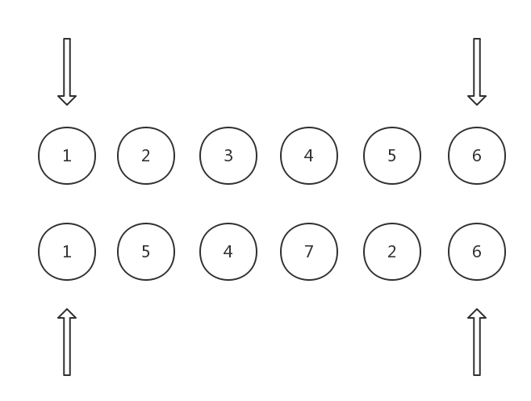

在 diff 的过程中，指针的移动可能出现 6 种情况：

- 下文中 `new children` 和 `old chilren` 分别简称为 `ch` 和 `oldCh`
- 关于 `sameVnode` 的定义，上文已经给出

---

**情况 1: 双方头指针指向的 vnode 是 sameVnode**

这种情况说明 `oldCh` 和 `ch` 头指针对应的真实 DOM 节点可以直接复用，这时候只需将他们的头指针同时向后移动即可:

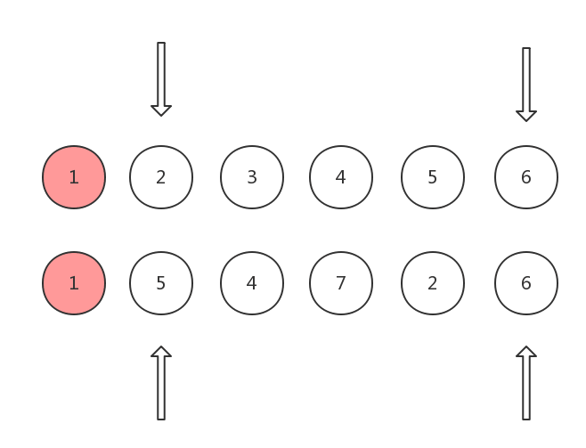

---

**情况 2: 双方尾指针指向的 vnode 是 sameVnode**

这种情况说明 `oldCh` 和 `ch` 尾指针对应的真实 DOM 节点可以直接复用，这时候只需要将它们的尾指针同时向前移动即可:

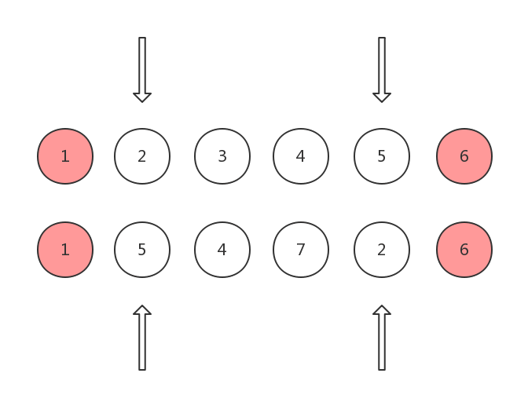

---

**情况 3: oldCh 头指针指向的 vnode 和 ch 尾指针指向的 vnode 是 sameVnode**

这种情况说明 `oldCh` 的头指针指向的 vnode 所对应的真实 DOM 节点可以复用，但是需要移动到 `oldCh` 尾指针指向的 vnode 所对应的真实 DOM 节点的后面，这样才能和 `ch` 保持一致:

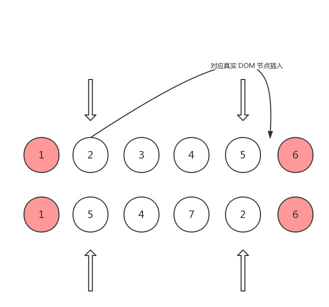

插入完成之后，`oldCh` 头指针向后移动，`ch` 尾指针向前移动:

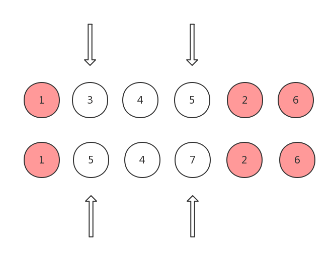

---

**情况 4: oldCh 尾指针指向的 vnode 和 ch 头指针指向的 vnode 是 sameVnode**

这种情况说明 `oldCh` 的尾指针指向的 vnode 所对应的真实 DOM 节点可以复用，但是需要移动到 `oldCh` 头指针指向的 vnode 所对应的真实 DOM 节点的前面，这样才能和 `ch` 保持一致:

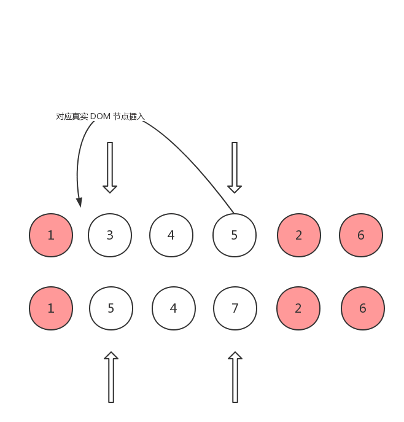

插入完成之后，`oldCh` 尾指针向前移动，`ch` 头指针向后移动:

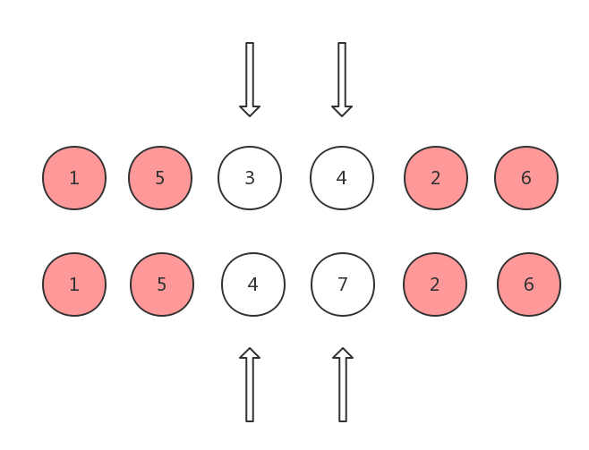

---

**情况 5: 在 oldCh 剩余的节点中可以找到与 ch 头指针指向的 vnode 是 sameVnode 的 vnode**

这种情况说明，`oldCh` 中还存在某个 vnode，其对应真实 DOM 节点可以复用，这时候需要将设置为 `elmToMove`，并且将其对应真实 DOM 节点移动到移动到 `oldCh` 头指针所对应真实 DOM 节点之前，这样才能和 `ch` 保持一致:

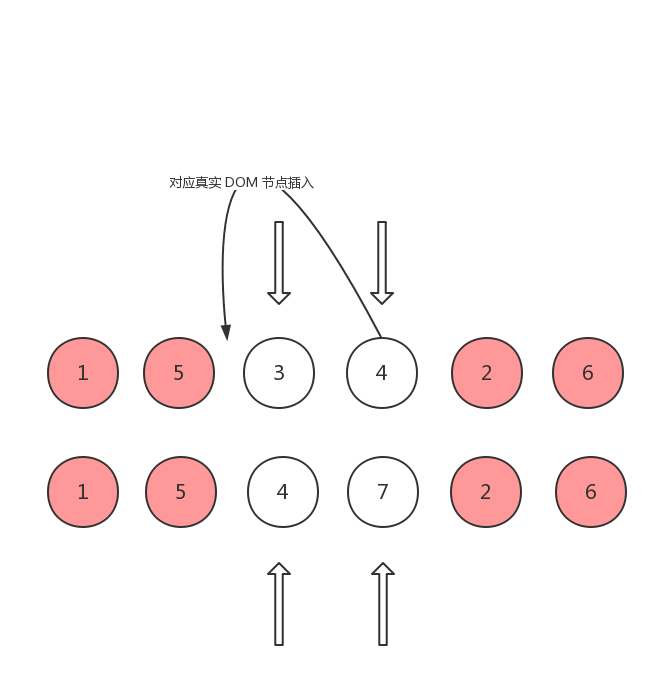

移动完之后，将刚刚 `oldCh` 中复用的节点 (`elmToMove`) 设置为 null，然后下次当头指针或者尾指针经过它时会跳过继续往下，并将 `ch` 的头指针向后移动：

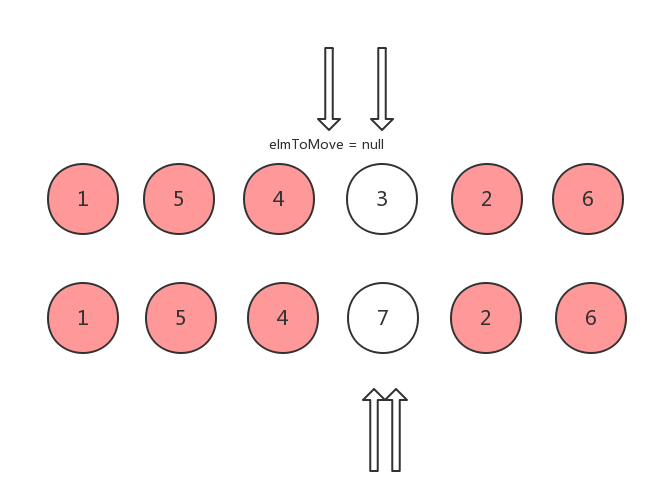

因为在本例中，刚好可以复用的节点就是 `oldCh` 的头指针指向的 vnode 所对应的真实 DOM 节点，所以下次它的头指针会自动向后移动，这个可复用节点也很可能会出现在剩余节点的中间位置

---

**情况 6: 如果以上情况都不符合，那么说明 ch 头指针指向的 vnode 是一个全新的节点**

这种情况说明，`oldCh` 已经不存在可复用的节点了，因此需要根据 `ch` 头指针所指向的 vnode 创建新的 DOM 节点，并插入到 `oldCh` 头指针所对应的真实 DOM 之前:

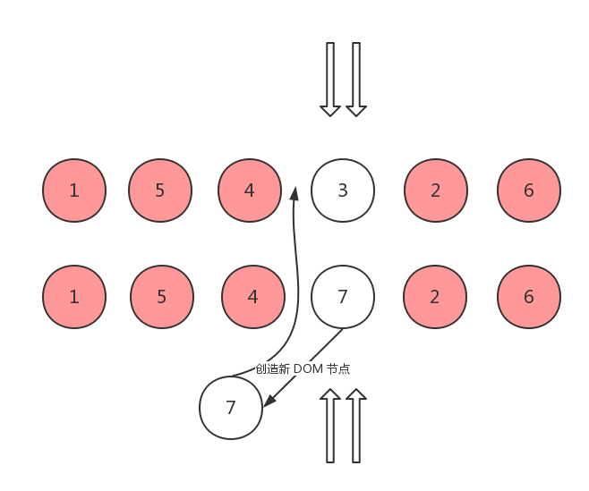

创建并移动完成之后，`ch` 头指针继续向后移动:

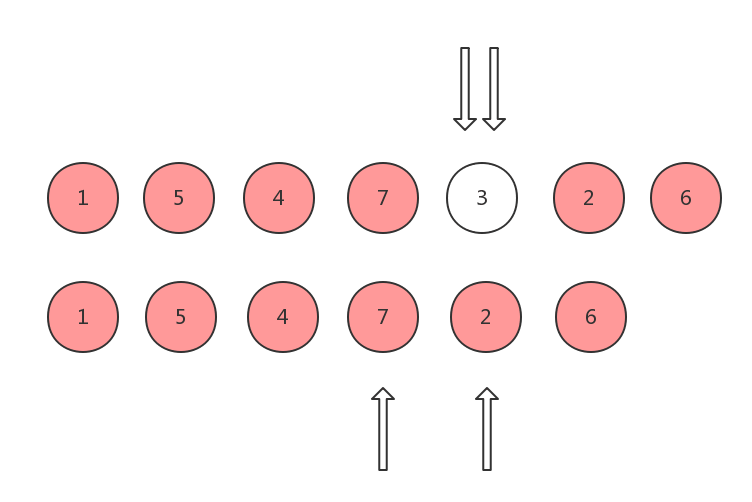

以上分别就分别对应着 6 种不同的情况

接下来还有一些收尾工作，当 **`ch` 头指针率先超过 `ch` 尾指针**，说明 diff 已经结束了，这时候 `oldCh` 头尾指针之间的剩余节点都是多余的节点，因此要**全部移除**。如果是 **`oldCh` 头指针率先超过 `oldCh` 尾指针**，说明 diff 也已经结束，但 `oldCh` 中所有可以复用的元素都已经复用过了，这时候 `ch` 头尾之间的剩余节点都是新的节点，因此要**全部创建并插入**到原有的 DOM 结构中

至此，整个 diff 的过程就分析完了

不过要注意的是，我们的示例都是直接移动头尾指针，真实的情况是要先对当前节点做 `patch` 将其子节点都 patch 完成之后再跳出来移动指针

以下代码就是，`updateChildren` 的实现：

```ts
function updateChildren(
  parentElm: Node,
  oldCh: Array<VNode>,
  newCh: Array<VNode>,
  insertedVnodeQueue: VNodeQueue
) {
  let oldStartIdx = 0,
    newStartIdx = 0;
  let oldEndIdx = oldCh.length - 1;
  let oldStartVnode = oldCh[0];
  let oldEndVnode = oldCh[oldEndIdx];
  let newEndIdx = newCh.length - 1;
  let newStartVnode = newCh[0];
  let newEndVnode = newCh[newEndIdx];
  let oldKeyToIdx: any;
  let idxInOld: number;
  let elmToMove: VNode;
  let before: any;

  while (oldStartIdx <= oldEndIdx && newStartIdx <= newEndIdx) {
    // 第五种情况下复用后删除引用后跳过
    if (oldStartVnode == null) {
      oldStartVnode = oldCh[++oldStartIdx]; // Vnode might have been moved left
    } else if (oldEndVnode == null) {
      // 第五种情况下复用后删除引用后跳过
      oldEndVnode = oldCh[--oldEndIdx];
    } else if (newStartVnode == null) {
      // 第五种情况下复用后删除引用后跳过
      newStartVnode = newCh[++newStartIdx];
    } else if (newEndVnode == null) {
      // 第五种情况下复用后删除引用后跳过
      newEndVnode = newCh[--newEndIdx];
    } else if (sameVnode(oldStartVnode, newStartVnode)) {
      // 第一种情况
      patchVnode(oldStartVnode, newStartVnode, insertedVnodeQueue);
      oldStartVnode = oldCh[++oldStartIdx];
      newStartVnode = newCh[++newStartIdx];
    } else if (sameVnode(oldEndVnode, newEndVnode)) {
      // 第二种情况
      patchVnode(oldEndVnode, newEndVnode, insertedVnodeQueue);
      oldEndVnode = oldCh[--oldEndIdx];
      newEndVnode = newCh[--newEndIdx];
    } else if (sameVnode(oldStartVnode, newEndVnode)) {
      // Vnode moved right
      // 第三种情况
      patchVnode(oldStartVnode, newEndVnode, insertedVnodeQueue);
      api.insertBefore(
        parentElm,
        oldStartVnode.elm as Node,
        api.nextSibling(oldEndVnode.elm as Node)
      );
      oldStartVnode = oldCh[++oldStartIdx];
      newEndVnode = newCh[--newEndIdx];
    } else if (sameVnode(oldEndVnode, newStartVnode)) {
      // Vnode moved left
      // 第四种情况
      patchVnode(oldEndVnode, newStartVnode, insertedVnodeQueue);
      api.insertBefore(
        parentElm,
        oldEndVnode.elm as Node,
        oldStartVnode.elm as Node
      );
      oldEndVnode = oldCh[--oldEndIdx];
      newStartVnode = newCh[++newStartIdx];
    } else {
      if (oldKeyToIdx === undefined) {
        oldKeyToIdx = createKeyToOldIdx(oldCh, oldStartIdx, oldEndIdx);
      }
      idxInOld = oldKeyToIdx[newStartVnode.key as string];
      if (isUndef(idxInOld)) {
        // 第六种情况
        api.insertBefore(
          parentElm,
          createElm(newStartVnode, insertedVnodeQueue),
          oldStartVnode.elm as Node
        );
        newStartVnode = newCh[++newStartIdx];
      } else {
        elmToMove = oldCh[idxInOld];
        if (elmToMove.sel !== newStartVnode.sel) {
          api.insertBefore(
            parentElm,
            createElm(newStartVnode, insertedVnodeQueue),
            oldStartVnode.elm as Node
          );
        } else {
          // 第五种情况
          patchVnode(elmToMove, newStartVnode, insertedVnodeQueue);
          oldCh[idxInOld] = undefined as any;
          api.insertBefore(
            parentElm,
            elmToMove.elm as Node,
            oldStartVnode.elm as Node
          );
        }
        newStartVnode = newCh[++newStartIdx];
      }
    }
  }
  // 结束 diff 之后的处理
  if (oldStartIdx <= oldEndIdx || newStartIdx <= newEndIdx) {
    if (oldStartIdx > oldEndIdx) {
      before = newCh[newEndIdx + 1] == null ? null : newCh[newEndIdx + 1].elm;
      // 添加剩余的新节点
      addVnodes(
        parentElm,
        before,
        newCh,
        newStartIdx,
        newEndIdx,
        insertedVnodeQueue
      );
    } else {
      // 移除所有多余的节点
      removeVnodes(parentElm, oldCh, oldStartIdx, oldEndIdx);
    }
  }
}
```

对算法比较了解的同学不难看出，其实这个 diff 算法类似于求解**[最短编辑距离问题](https://en.wikipedia.org/wiki/Edit_distance)**，diff 的过程中也无非是*插入*、_删除_、_移动（可以看做是插入和删除的结合）_，最常见的解法是[Levenshtein distance](https://en.wikipedia.org/wiki/Levenshtein_distance)

然而如果我们真的去实现 [Levenshtein distance](https://en.wikipedia.org/wiki/Levenshtein_distance) 算法，显然代价就有点大了。从 Snabbdom 的实现中我们可以看出，它优化了一些常见的操作，牺牲了一定的 DOM 操作(使用了 `insertBefore` 一步到位)，让算法的时间达到了 O(Max(M,N))

> 注：M 和 N 分别是旧 vnode 的 children 的长度和新 vnode 的 children 的长度

## 结语

Vue 原理解读这个系列总算是开坑了，主要是方便自己更深入地理解框架背后的原理，便于写出更优雅更健壮的程序

也希望有机会读了这个系列的朋友能够得到一些启发

## 参考资料

> - https://github.com/snabbdom/snabbdom
> - https://css-tricks.com/what-does-the-h-stand-for-in-vues-render-method/
> - https://medium.com/@jiyinyiyong/virtual-dom-is-the-new-ir-67839bcb5c71
> - https://github.com/zyl1314/blog/issues/11
> - https://zhuanlan.zhihu.com/p/33173035
> - https://github.com/livoras/blog/issues/13
