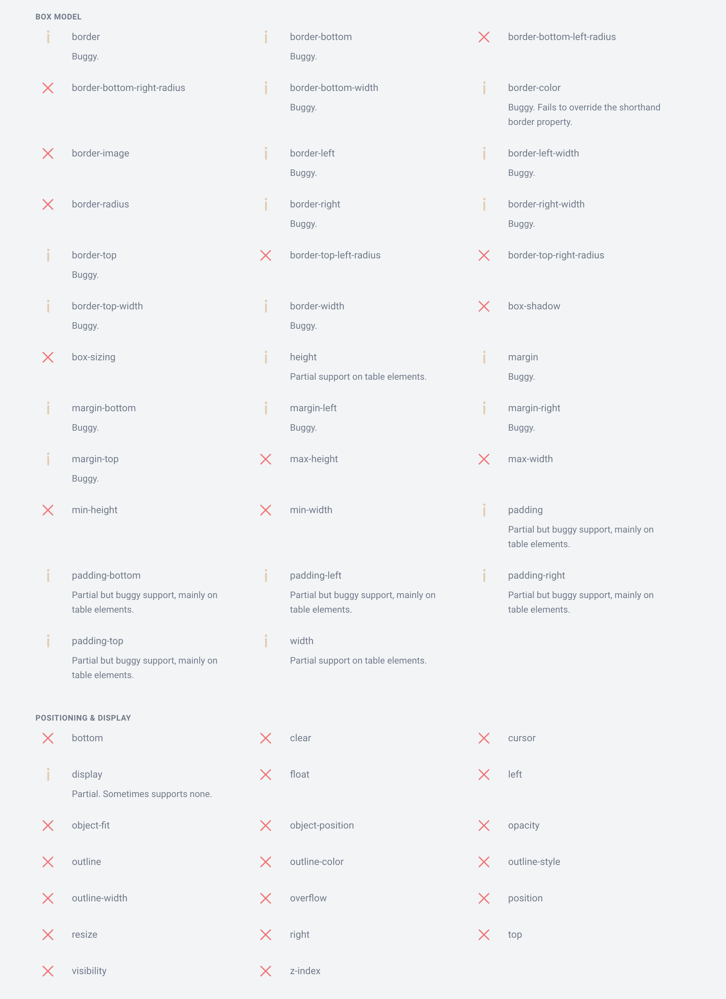

## 前言

如果我告诉你，世界上有这么一种方法，可以让你体验下 90 年代的开发生活

那么你一定要尝试一下编写 HTML 邮件，保证让你抓狂

最近我就遇到了这样的问题，我在给公司开发内部邮件平台的邮件模板

遇到了很多兼容性的问题

这也是这篇博客诞生的初衷

## 编码 HTML 邮件是一件极具挑战的事情

假设你已经是一名前端开发者，使用 HTML 和 CSS 布局对你来说已经没有太大的难度了

然而当你着手开发 HTML Email 的时候，你会发现自己仿佛进入了原始世界

什么？`float` 不能正常工作？更别说什么 `flexbox` 以及 `Grid layout` 了

无奈之下你只好使出 `table` 大法，却发现还是有很多问题，那么这是为什么呢？

那是因为**Email 标准并不存在**

不像 `HTML` 和 `CSS` 那样有 `W3C` 为他们不断地指定标准并修正

Email 就像一匹脱缰的野马，没有任何束缚

和浏览器相比，Email 客户端并不想浏览器那样发展迅猛，每年都在不断地追求着更高的标准

事实上，邮件客户端的技术已经趋于稳定，许多邮件客户端甚至多年没有更新

同时，也因为安全性问题，邮件客户端剥夺了许多 HTML 的一些能力，来防止一些潜在的安全性问题
xw
因此，当你在编码 HTML Email 的时候，你要面对的是从最新的邮件客户端到最老的邮件客户端的渲染差异

那些新的 CSS 特性，新的 HTML 特性，呵呵，就想想吧

社区里也只有一些开发者自发组织的项目，比如 [Email Standards Project](https://www.email-standards.org/index.html)

然而也没有多大进展

> 如果你已经对 web 开发很熟悉了，那么请忘掉你所知的一切吧

## 主要邮件客户端的兼容性情况

随便截了一张 Outlook 2007-16 的 CSS 属性的兼容情况



> 图片来源 https://www.campaignmonitor.com/css/ 这里可以查看各大邮件客户端 CSS 属性的支持情况

大家自行感受下，然后再看看 Apple 和 Google 的，你会发现他们是多么良心

[这里](http://emailclientmarketshare.com/)有当前 Email 客户端的一个市场份额的数据，仅供参考

总而言之，如果你想要编写一份兼容性良好的 HTML Email

那么你将不得不抛弃大量的新特性，重新拾起那些过时的特性和布局方法

## HTML Email 是如何生效的

在你正式开始设计、编码、测试之前，你应该了解一下 HTML Email 的工作机制是怎样的

### Multipart/Alternative MIME 格式

我们不能直接就将写好的 HTML 文件直接发送给邮件接收者

大多数邮件应用默认以普通文本的形式发送邮件，所以 HTML 文本并不会渲染

你的邮件接收者很可能看到的全是你发过去的源码

因此，你应该在你的邮件服务器上使用 `Content-Type: multipart/alternative` 的 MIME 格式发送

这样接收方才能够浏览到正常渲染的 Email

这也意味着，大多数邮件客户端不会把 HTML 当做真正的 HTML 来渲染

这就是最让人头疼的问题

## 如何开发出能够正确渲染的 HTML Email

### !Doctype

```html
<!DOCTYPE html PUBLIC "-//W3C//DTD XHTML 1.0 Transitional//EN" "http://www.w3.org/TR/xhtml1/DTD/xhtml1-transitional.dtd">
<html xmlns="http://www.w3.org/1999/xhtml">
  <head>
    <meta http-equiv="Content-Type" content="text/html; charset=UTF-8" />
    <title>Meaningful title</title>
    <meta name="viewport" content="width=device-width, initial-scale=1.0" />
  </head>
</html>
```

虽然许多邮件会删除 DOCTYPE 或者不允许有 DOCTYPE，但是我们最好还是设置一个。我们使用 web 2.0 时代最为可靠的 XHTML 1.0 Transitional 模式

然后使用 meta 标签来指定文本的编码以及文本的渲染方式 (`text/html`) 以及视口的宽度

### 图像处理

在 HTML Email 中处理图片可能会遇到这些问题：

- 不同的电子邮件客户端会给链接图片添加不必要的边框
- 电子邮件客户端会给图像底部添加空白的空间
- 默认情况下，许多电子邮件客户端在显示邮件的的时候会禁止显示图像

对应这些情况，我们需要使用一些针对性的样式来处理:

```css
img {
  outline: none;
  text-decoration: none;
  -ms-interpolation-mode: bicubic;
}

a img {
  border: none;
}

.image_fix {
  display: block;
}
```

### 布局

HTML Email 布局的关键在于使用 `table` 元素来进行布局

因为缺少一些 HTML 标准的支持，我们基本上没有办法使用 `div` 元素来进行布局

但是我们还可以使用 `table` 来布局

并且我们需要使用大量的嵌套 `table` 来进行布局，因为 `colspan` 和 `rowspan` 属性支持性也不是很好

所以最终你写起来的代码看起来会是这样的

```html
<table>
  <tbody>
    <tr>
      <td>
        <table>
          ...
        </table>
      </td>
    </tr>
    <tr>
      <td>
        <table>
          ...
        </table>
      </td>
    </tr>
  </tbody>
</table>
```

在代码编辑器里看起来像是蛇形的就对了

并且你还可以大量的使用 HTML 标准规范已经不推荐的属性

比如: `cellpadding`, `width` 等等，这些属性在 HTML Email 中反而很有用

### 样式

样式尽量使用内联样式，因为不保证所有的 Email 客户端都能够正确的支持 `style` 标签

但是你可以现在 `style` 标签中写好样式，然后使用样式[内联工具](https://templates.mailchimp.com/resources/inline-css/)来内联样式

然后输出生产环境的 HTML 代码，这样也方便开发

CSS 属性不要使用简写(例如：font: 8px/14px Arial, sans-serif;), 否则也可能无法正常生效

每个 HTML 元素最好只有一个类名

...

### 测试

HTML Email 的测试是相当令人头疼

因为 Email 客户端多且分散，很难覆盖到所有的情况

如果有一定的资金支持，可以使用 [LITMUS](https://litmus.com/) 或者是 [EMAIL ON AID](/www.emailonacid.com) 这样的企业级开发测试平台

当然，它们价格不菲

如果没有财力支持测试的话，可以使用 [INBOX INSPECTOR](http://www.inboxinspector.com/) 来进行免费可视化测试

但是它只支持几种插件的 Email 客户端的测试

还可以使用 [Premailer](http://premailer.dialect.ca/) 这样的预检查工具，在发布之前测试代码的兼容性

除此之外，我暂时也没有发现什么特别好的办法

### 整套解决方案

如果你觉得自己从头开始写 HTML Email 过于麻烦的话

可以直接使用上述的企业级开发平台来进行开发，他们都提供了模板以及在线编辑的解决方案

或者你也可以使用这几种开源的解决方案：

- [HTML Email 模板](https://github.com/seanpowell/Email-Boilerplate)
- 针对 Email 的 CSS 框架 [Bojler](http://bojler.slicejack.com/)

### 参考

> - https://webdesign.tutsplus.com/tutorials/what-you-should-know-about-html-email--webdesign-12908

- https://templates.mailchimp.com
- https://www.campaignmonitor.com
- http://bojler.slicejack.com
- https://github.com/seanpowell/Email-Boilerplate
