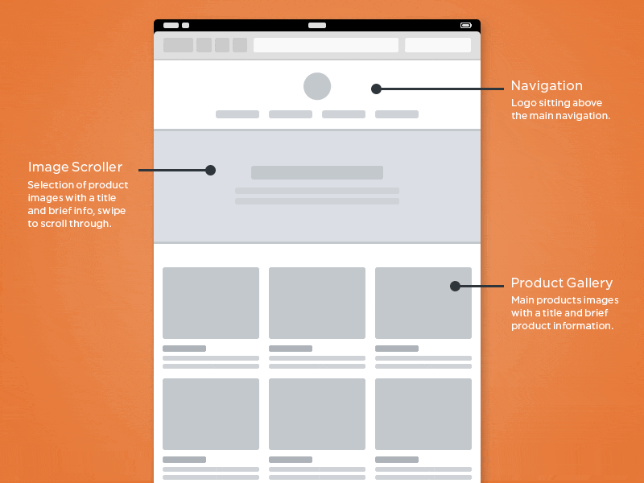
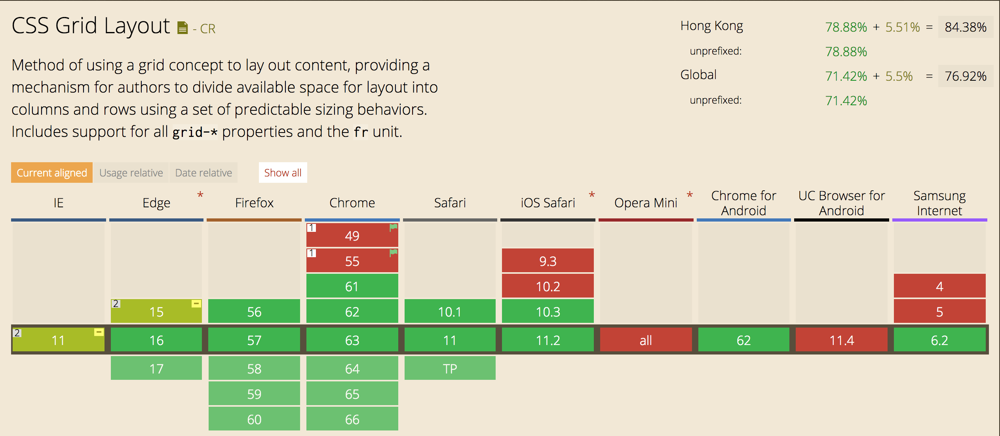
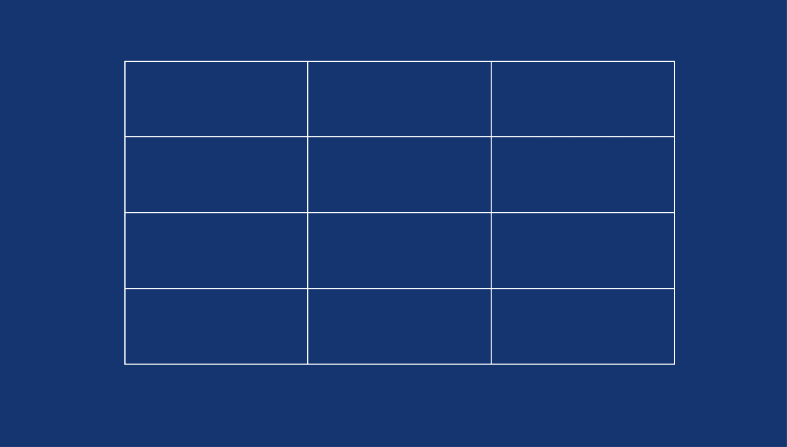
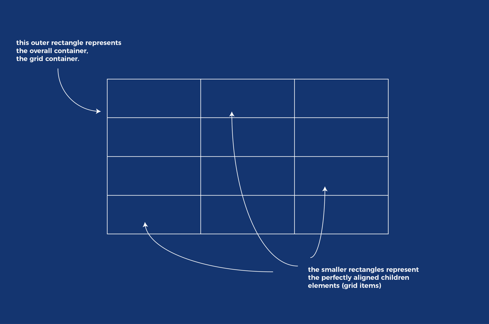
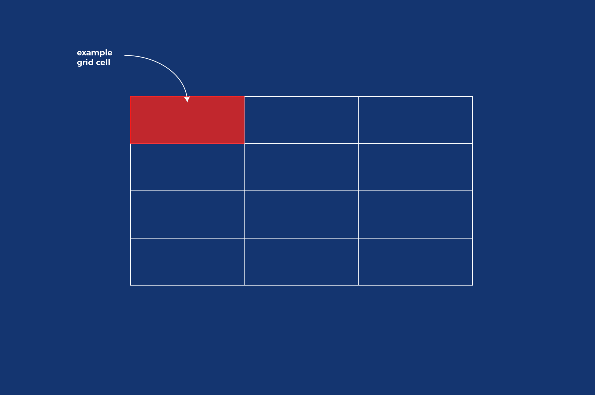
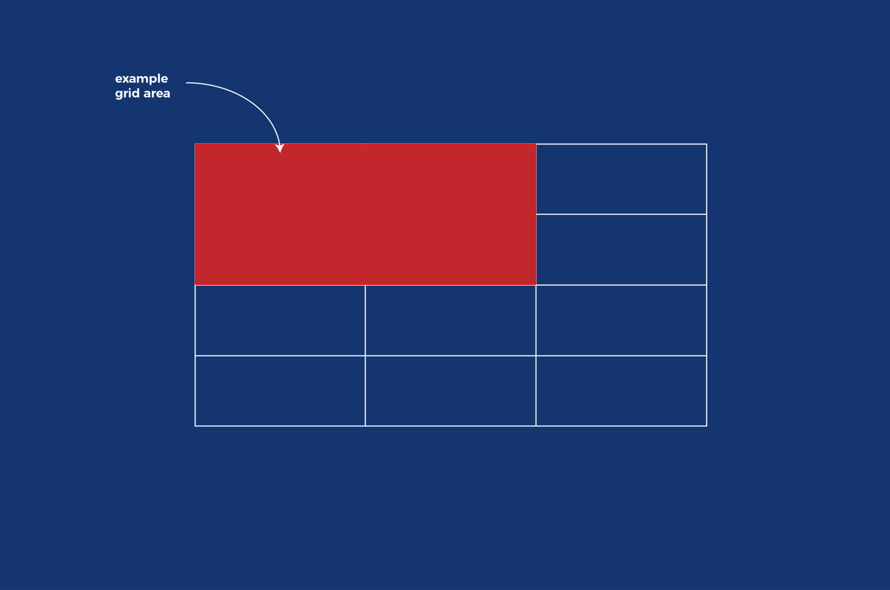
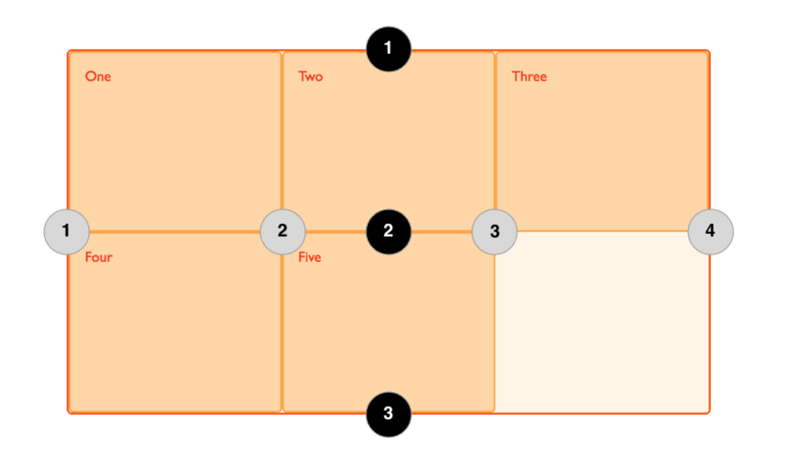
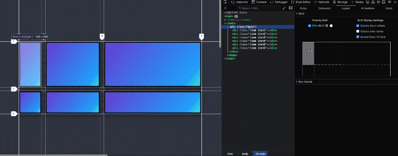

## 概述

从 **Table** 到 **Float** 再到 **Flexbox**，CSS 的布局方式一直在不断地进化和演变

并且功能变得越来越强大，使用方式变得越来越简易

今天，我想谈一谈下一代的布局方式： **Grid Layout (网格布局)**

其实在实际的布局中，我们之前都是在用各种不同地方式来模拟网格的行为

如今 CSS 赋予了我们使用原生的网格来进行布局



## 可用性

这个不多说，先上一张图：



`CSS Grid Layout` 目前来说还没有全面普及，但是市面上大部分最新的浏览器实现了这个特性

并且移动端的支持还不是特别好

随着这几年各大厂商都在齐心协力地推动 Web 标准化进程，相信很快我们就能全面地使用上 `CSS Grid Layout`

## Basis

CSS 网格布局是一个**二维**布局系统，它定义了网格的行和列，我们可以将具体的元素放置在这些行与列相关的位置上

首先让我们先了解一些网格的一些重要的基本概念(术语)：

> 注意：以下的术语都是抽象的描述，具体的例子将在之后呈现

### 网格容器 -- Grid Container

简单的来说，一个网格是由水平方向和垂直方向的线组成的

在网格布局中，网格容器是包含容纳所有在网格中的元素的这样一个容器

网格容器定义了网格的垂直方向的线和水平方向的线的放置情况

#### 网格线 -- Grid Line

网格线将网格容器从垂直和水平方向划分为不同的网格区间：



### 网格项目 -- Grid Item

网格容器中所有的直接子元素



#### 网格单元格 -- Grid Cell

网格单元格是网格布局中最小的单元，它是四条网格线包围所形成的区域：



#### 网格区域 -- Grid Area

网格区域是由网格布局中若干个单元格组成的一个区域：



#### 网格轨道 -- Grid Track

这个属于听起来非常花哨，但是其实它不过代表着网格中的行与列

准确的说，它代表着两条网格线之间的空间，这个空间可以是垂直方向的，也可以是水平方向的：


#### 网格槽 -- Gutter

网格槽代表着网格中行与列之间的间隙，需要注意的是它并不占据网格的行列的尺寸

## 使用网格容器

我们通过在元素上声明 `display：grid` 或者 `display：inline-grid` 就可以创建一个网格容器

这样，这个元素的所有**直接子元素**将成为网格项目

<p data-height="305" data-theme-id="light" data-slug-hash="BJWJRm" data-default-tab="result" data-user="Mactavish" data-embed-version="2" data-pen-title="Grid-Learn-1" data-preview="true" class="codepen">See the Pen <a href="https://codepen.io/Mactavish/pen/BJWJRm/">Grid-Learn-1</a> by Mac for Real (<a href="https://codepen.io/Mactavish">@Mactavish</a>) on <a href="https://codepen.io">CodePen</a>.</p>
<script async src="https://production-assets.codepen.io/assets/embed/ei.js"></script>

我们在对其子元素不做任何操作的情况下，默认创建了一个单列的网格

## 使用网格轨道

我们可以通过 `grid-template-columns` 和 `grid-template-rows` 属性来定义网格中的行和列

这些属性定义了网格的轨道，之前我们提到过，轨道就是网格中两条线之间的空间

```html
<div class="grid-wrapper">
  <div>1</div>
  <div>2</div>
  <div>3</div>
  <div>4</div>
  <div>5</div>
</div>
```

```css
.grid-wrapper {
  display: grid;
  grid-template-columns: 200px 200px 200px;
}
```

这样我们就创建了一个网格，包含三个 200px 宽度的轨道

子项目会按照他们书写的先后顺序放入网格单元中

<p data-height="322" data-theme-id="light" data-slug-hash="ZveVBV" data-default-tab="result" data-user="Mactavish" data-embed-version="2" data-pen-title="Grid-Learn-2" data-preview="true" class="codepen">See the Pen <a href="https://codepen.io/Mactavish/pen/ZveVBV/">Grid-Learn-2</a> by Mac for Real (<a href="https://codepen.io/Mactavish">@Mactavish</a>) on <a href="https://codepen.io">CodePen</a>.</p>
<script async src="https://production-assets.codepen.io/assets/embed/ei.js"></script>

### fr 单位

轨道单位可以使用任何长度单位来定义，不过网格系统引入了一个新的长度单位来帮助我们创建灵活的网络轨道

`fr` (fraction 的缩写) 有着分数的意思，1 个 `fr` 代表网格容器可用空间的一等分

```css
.grid-wrapper {
  display: grid;
  grid-template-columns: 1fr 1fr 2fr;
}
```

在上面这个例子中，我们创建了三个轨道，可用空间被四等分，前两个轨道各占一份，最后一个轨道占两份

除此之外我们还可以混合使用固定的长度单位和 `fr`:

```css
.grid-wrapper {
  display: grid;
  grid-template-columns: 1fr 1fr 200px;
}
```

拥有良好的界面布局的规划必定会让 CSS 写起来非常轻松，但在大型的网格规划中，我们不太可能依次手写所有的轨道

因此，网格系统还提供了 `repeat()` 标记，帮助我们轻松的定义重复的轨道

```css
.wrapper {
  display: grid;
  grid-template-columns: 1fr 1fr 1fr;
}

/* 可以改写为 */
.wrapper {
  display: grid;
  grid-template-columns: repeat(3, 1fr);
}
```

`repeat()` 语句还可以和其他的轨道定义混合使用

```css
.wrapper {
  display: grid;
  grid-template-columns: 500px repeat(3, 1fr) 2fr;
}
```

`repeat()` 语句还可以传入一个轨道列表，以此来创建重复的多轨道模式

```css
.wrapper {
  display: grid;
  grid-template-columns: repeat(3, 1fr, 2fr);
}
```

上这个例子一共创建了 6 个轨道，具体表现为 1fr 的轨道后面跟着 2fr 的轨道，这个模式重复三次

### 显式网格和隐式网格

之前我们创建网格的时候，只显示地用 `grid-template-columns` 属性指定了网格的列轨道

然后以网格按照所需的内容自己创建行，这些行会被创建在隐式的网格中

显示网格包含着 `grid-template-columns` 和 `grid-template-rows` 属性中定的行和列

但是如果你在预先定义的网格之外又多放置了一些内容，这些内容需要更多的网格轨道的时候

网格将会隐式地创建行和列

我们可以在隐式网格中用 grid-auto-rows 和 grid-auto-columns 属性来定义设置了大小尺寸的轨道

```html
<div class="grid-wrapper">
  <div>1</div>
  <div>2</div>
  <div>3</div>
  <div>4</div>
  <div>5</div>
</div>
```

```css
.grid-wrapper {
  display: grid;
  grid-template-columns: repeat(3, 1fr);
  grid-auto-rows: 200px;
}
```

先前的例子我们就指定了 `grid-auto-rows` 属性

### 轨道大小

我们可以控制轨道的大小的自动伸缩行为，比如我们希望网格的行是自动的尺寸是自动的

但是我们希望给它设置一个最小值以及最大值，或者让它自动延伸

这时候我们可以使用网格的 `minmax()` 方法:

```css
.grid-wrapper {
  display: grid;
  grid-template-columns: repeat(3, 1fr);
  grid-auto-rows: minmax(100px, auto);
}
```

这个例子中，自动创建的行的高度最小为 100px，`auto` 意味着该行的尺寸会根据内容的尺寸自动变换

<p data-height="330" data-theme-id="light" data-slug-hash="GyWPYM" data-default-tab="result" data-user="Mactavish" data-embed-version="2" data-pen-title="Grid-Learn-4" data-preview="true" class="codepen">See the Pen <a href="https://codepen.io/Mactavish/pen/GyWPYM/">Grid-Learn-4</a> by Mac for Real (<a href="https://codepen.io/Mactavish">@Mactavish</a>) on <a href="https://codepen.io">CodePen</a>.</p>
<script async src="https://production-assets.codepen.io/assets/embed/ei.js"></script>

除了对行使用自动尺寸和定位，我们还可以对列进行设置，只需要设置 `grid-auto-flow` 为 `column` 即可

此时将根据已经定义的 `grid-template-rows` 按列摆放项目：

```css
.grid-wrapper {
  display: grid;
  grid-template-rows: repeat(3, 200px);
  grid-gap: 10px;
  grid-auto-flow: column;
  grid-auto-columns: 300px;
}
```

```html
<div class="grid-wrapper">
  <div class="box">1</div>
  <div class="box">2</div>
  <div class="box">3</div>
  <div class="box">4</div>
  <div class="box">5</div>
  <div class="box">6</div>
  <div class="box">7</div>
  <div class="box">8</div>
</div>
```

我们来看看效果：

<p data-height="692" data-theme-id="light" data-slug-hash="XVMQxr" data-default-tab="result" data-user="Mactavish" data-embed-version="2" data-pen-title="Grid-Learn-9" data-preview="true" class="codepen">See the Pen <a href="https://codepen.io/Mactavish/pen/XVMQxr/">Grid-Learn-9</a> by Mac for Real (<a href="https://codepen.io/Mactavish">@Mactavish</a>) on <a href="https://codepen.io">CodePen</a>.</p>
<script async src="https://production-assets.codepen.io/assets/embed/ei.js"></script>

## 使用网格线

当我们在定义网格时候，我们使用的是 `网格轨道(Grid Track)`

定义好网格之后，网格系统会自动给我们创建编号来让我们定位每个网格项目，网格线如下：



网格线的编号顺序取决于 `writing-mode` 的值，也就是内容的书写顺序

从左到右的书写模式编号为 1 的网格线在最左边，反之在最右边

我们只需知道要重要的一点: 当放置元素的时候，我们使用网格线来定位，而不是网格轨道

控制元素位置主要有个四个属性：`grid-column-start`, `grid-column-end`, `grid-row-start`, `grid-row-end`

我们来看看下面这个例子：

```css
.grid-wrapper {
  width: 500px;
  margin: 0 auto;
  display: grid;
  grid-template-columns: repeat(3, 1fr);
  grid-auto-rows: 70px;
  grid-gap: 10px;
}

.box1 {
  grid-column-start: 1;
  grid-column-end: 4;
  grid-row-start: 3;
}

.box2 {
  grid-row-start: 2;
  grid-column-start: 1;
  grid-column-end: 3;
}

.box3 {
  grid-column-start: 3;
  grid-row-start: 2;
}

.box4 {
  grid-column-start: 1;
  grid-column-end: 4;
  grid-row-start: 1;
}
```

<p data-height="368" data-theme-id="light" data-slug-hash="GyWPJj" data-default-tab="result" data-user="Mactavish" data-embed-version="2" data-pen-title="Grid-Learn-3" data-preview="true" class="codepen">See the Pen <a href="https://codepen.io/Mactavish/pen/GyWPJj/">Grid-Learn-3</a> by Mac for Real (<a href="https://codepen.io/Mactavish">@Mactavish</a>) on <a href="https://codepen.io">CodePen</a>.</p>
<script async src="https://production-assets.codepen.io/assets/embed/ei.js"></script>

我们可以看到，即使我们的 DOM 结构是按照顺序书写的

但是我们依旧可以随意地在网格中指定他们的位置

如果我们指定了元素的开始线，但是没有指定结束线，那么默认情况下，元素只会占据一个网格轨道，如 `box5` 所显示的效果

如果没有给元素指定具体的位置，那么元素会把自己安放到网格的剩余空间中，或者创建扩展的隐式网格

> Tips: 我们还可以直接使用其简写形式： `grid-row: [start] / [end];` 以及 `grid-column: [start] / [end];`

### 网格间距

两个网格项目之间的横向间距或者纵向间距，或者说是行与列之间的间距

可以使用 `grid-column-gap` 和 `grid-row-gap` 属性来定义，或者使用一个 `grid-gap` 来同时定义

间距所使用的空间会在弹性长度 `fr` 的轨道空间计算前就被预留出来

间距尺寸的定义和普通轨道的定义一模一样，只是不能向里面插入内容，可以把它想象成一条很宽的网格线

上面那个例子就使用了 `grid-gap`

## z-inde 控制层级

多个网格项目可以占据同一个网格单元，实现互相覆盖的效果

我们修改一下之前的例子：

<p data-height="319" data-theme-id="light" data-slug-hash="zpZerq" data-default-tab="result" data-user="Mactavish" data-embed-version="2" data-pen-title="Grid-Learn-5" data-preview="true" class="codepen">See the Pen <a href="https://codepen.io/Mactavish/pen/zpZerq/">Grid-Learn-5</a> by Mac for Real (<a href="https://codepen.io/Mactavish">@Mactavish</a>) on <a href="https://codepen.io">CodePen</a>.</p>
<script async src="https://production-assets.codepen.io/assets/embed/ei.js"></script>

我们会发现 box4 和 box2 互相重叠了，并且 box4 置于 box2 之上

这是因为其覆盖顺序遵循了文档流的原始顺序（后来居上）

### 控制顺序

在网格项目发生堆积时，使用 `z-index` 属性来控制堆积的顺序即可：

<p data-height="308" data-theme-id="light" data-slug-hash="VypgKr" data-default-tab="result" data-user="Mactavish" data-embed-version="2" data-pen-title="Grid-Learn-6" data-preview="true" class="codepen">See the Pen <a href="https://codepen.io/Mactavish/pen/VypgKr/">Grid-Learn-6</a> by Mac for Real (<a href="https://codepen.io/Mactavish">@Mactavish</a>) on <a href="https://codepen.io">CodePen</a>.</p>
<script async src="https://production-assets.codepen.io/assets/embed/ei.js"></script>

这样我们就可以手动地控制堆叠的顺序

## 高级

之前我们简单的介绍了 `CSS Grid Layout` 的基本用法

那么现在我们再来说一下一些更为高级的用法

### Grid Area

除了使用默认的网格线的编号来进行网格项目的定位，我们最多的时候需要写四个属性

那么有没有更简洁的方式呢？

答案是有，网格系统提供了 `grid-area` 属性，来给每个网格元素进行快捷的定位

值的顺序如下:

- grid-row-start
- grid-column-start
- grid-row-end
- grid-column-end

```css
.box {
  grid-area: 1 / 1 / 4 / 2;
}
```

需要注意的是，这种写法的顺序和我们简写 `margin`, `padding` 等属性的时候的`上右下左`的顺序是完全不同的

### Grid Template Areas

在了解了 `grid-area` 属性之后，我们还可以进一步地使用它来实现 `命名` 的定位

这种给区域命名来定位的方式叫做 `模板区域(Template Areas)`，对应的属性是 `grid-template-areas`

通过 `grid-area` 属性为这些区域各分配一个名字，然后使用 `grid-template-areas` 来创建布局：

首先看看 HTML 结构：

```html
<div class="grid-wrapper">
  <div class="header">header</div>
  <div class="sidebar">sidebar</div>
  <div class="content-1">Content-1</div>
  <div class="content-2">Content-2</div>
  <div class="content-3">Content-3</div>
  <div class="footer">footer</div>
</div>
```

然后对要布局的区域进行命名：

```css
.header {
  grid-area: header;
}

.sidebar {
  grid-area: sidebar;
}

.content-1 {
  grid-area: content-1;
}

.content-2 {
  grid-area: content-2;
}

.content-3 {
  grid-area: content-3;
}

.footer {
  grid-area: footer;
}
```

最后在网格容器中指定布局的方式：

```css
.grid-wrapper {
  display: grid;
  width: 100%;
  height: 600px;
  grid-template-columns: 200px 1fr 1fr;
  grid-template-rows: 80px 1fr 1fr 100px;
  grid-gap: 1rem;
  grid-template-areas:
    'header header header'
    'sidebar content-1 content-1'
    'sidebar content-2 content-3'
    'footer footer footer';
}
```

来看看最终的效果：

<p data-height="397" data-theme-id="light" data-slug-hash="JMWVXg" data-default-tab="result" data-user="Mactavish" data-embed-version="2" data-pen-title="Grid-Learn-7" data-preview="true" class="codepen">See the Pen <a href="https://codepen.io/Mactavish/pen/JMWVXg/">Grid-Learn-7</a> by Mac for Real (<a href="https://codepen.io/Mactavish">@Mactavish</a>) on <a href="https://codepen.io">CodePen</a>.</p>
<script async src="https://production-assets.codepen.io/assets/embed/ei.js"></script>

区域命名还支持空白单元格，只需要使用 `.` 字符来进行占位即可，不过要注意中间要加上空格，否则只会被当做一个区域：

```css
.grid-wrapper {
  /* ... */
  grid-template-areas:
    'header header header'
    'sidebar . content-1'
    'sidebar content-2 content-3'
    '. footer footer';
}
```

### Named Lines

在之前的例子中，我们了解了如何设置网格线的跨度来设置网格轨道的大小

在用 `grid-template-rows` 和 `grid-template-columns` 属性定义网格时，可以为网格中的部分或全部网格线命名

在定义网格时，把网格线的名字写在方括号内加载尺寸前面，名字随意，我们使用上面那个例子做改动:

```css
.grid-wrapper {
  display: grid;
  width: 100%;
  height: 600px;
  grid-gap: 1rem;
  grid-template-columns:
    [main-start sidebar-start] 200px
    [sidebar-end content-start] 1fr
    [column3-start] 1fr
    [content-end main-end];
  grid-template-rows:
    [row1-start] 80px
    [row2-start] 1fr
    [row3-start] 1fr
    [row4-start] 100px
    [row4-end];
}
```

对网格项目的 CSS 稍作改动：

```css
.header {
  grid-column: main-start / main-end;
  grid-row: row1-start / row2-start;
}

.sidebar {
  grid-column: sidebar-start / sidebar-end;
  grid-row: row2-start / row4-start;
}

.content-1 {
  grid-column: content-start / content-end;
  grid-row: row2-start / row3-start;
}

.content-2 {
  grid-column: content-start / column3-start;
  grid-row: row3-start / row4-start;
}

.content-3 {
  grid-column: column3-start / content-end;
  grid-row: row3-start / row4-start;
}

.footer {
  grid-column: main-start / main-end;
  grid-row: row4-start / row4-end;
}
```

HTML 结构保持不变：

```html
<div class="grid-wrapper">
  <div class="header">header</div>
  <div class="sidebar">sidebar</div>
  <div class="content-1">Content-1</div>
  <div class="content-2">Content-2</div>
  <div class="content-3">Content-3</div>
  <div class="footer">footer</div>
</div>
```

<p data-height="265" data-theme-id="light" data-slug-hash="BJWEJJ" data-default-tab="result" data-user="Mactavish" data-embed-version="2" data-pen-title="Grid-Learn-8" data-preview="true" class="codepen">See the Pen <a href="https://codepen.io/Mactavish/pen/BJWEJJ/">Grid-Learn-8</a> by Mac for Real (<a href="https://codepen.io/Mactavish">@Mactavish</a>) on <a href="https://codepen.io">CodePen</a>.</p>
<script async src="https://production-assets.codepen.io/assets/embed/ei.js"></script>

### 网格布局中的盒模型对齐方式

如果你熟悉 `flexbox`，那么你应该已经了解了 flex 容器中处理 flex 项目的对齐方式的方法了

这些对齐属性最初是出现在 flex 布局当中，后来被移到了 `CSS Box Alignment Module Level 3` 规范当中

网格布局方式下共有两条轴线用于对齐 —— 块方向的列轴和文字方向的行轴

属性 `align-self` 和 `align-items` 用于控制项目在块方向的轴上对齐，通过设置这两个属性，可以改变网格区域中的项目的对齐方式

可选值：

- auto
- normal
- start
- end
- center
- stretch
- baseline
- first baseline
- last baseline

与 `align-items` 和 `align-self` 用于对齐项目到块方向的轴类似，`justify-items` 和 `justify-self` 用于对齐项目到文本方向的列轴，可选值也和 `align-self` 一样

这里只展示一个水平垂直居中对齐的例子：

<p data-height="272" data-theme-id="light" data-slug-hash="PEpvYe" data-default-tab="result" data-user="Mactavish" data-embed-version="2" data-pen-title="Grid-Learn-10" data-preview="true" class="codepen">See the Pen <a href="https://codepen.io/Mactavish/pen/PEpvYe/">Grid-Learn-10</a> by Mac for Real (<a href="https://codepen.io/Mactavish">@Mactavish</a>) on <a href="https://codepen.io">CodePen</a>.</p>
<script async src="https://production-assets.codepen.io/assets/embed/ei.js"></script>

## 布局可视化调试工具

Firefox DevTools 提供了强大的 Grid 布局调试工具，可以可视化地调试显示出网格的各种细节



但是注意目前只有 Firefox Developer Edition 才有这个功能

## 总结

Grid 布局基本上涵盖了过去的布局方案里的所遇到的问题

并且提供了更加强大的布局方式，无论是手动设置还是自动调整适应

和 Flex 布局相比，Grid 多出了一个维度的控制，因此可以更加实现更多 Flex 布局做不到的布局方案

不过也并不能说 Grid 布局普及了之后 Flex 布局就没有用处了

加入我们是按照内容来布局的，比如说我们希望有一组元素，能够平均地分布在容器中，并且让内容的大小来决定元素所占的空间

并且超出容器范围会自动换行

这时候我们直接使用 Flex 布局就非常地方便

如果我们是直接从布局入手，已经规定好了网格的组织形式，然后再把元素放置到网格当中，那么使用 Grid 布局会更合适

## 参考

>

- https://developer.mozilla.org/en-US/docs/Web/CSS/CSS_Grid_Layout
- https://mozilladevelopers.github.io/playground/css-grid/
- https://medium.com/flexbox-and-grids/how-to-efficiently-master-the-css-grid-in-a-jiffy-585d0c213577
