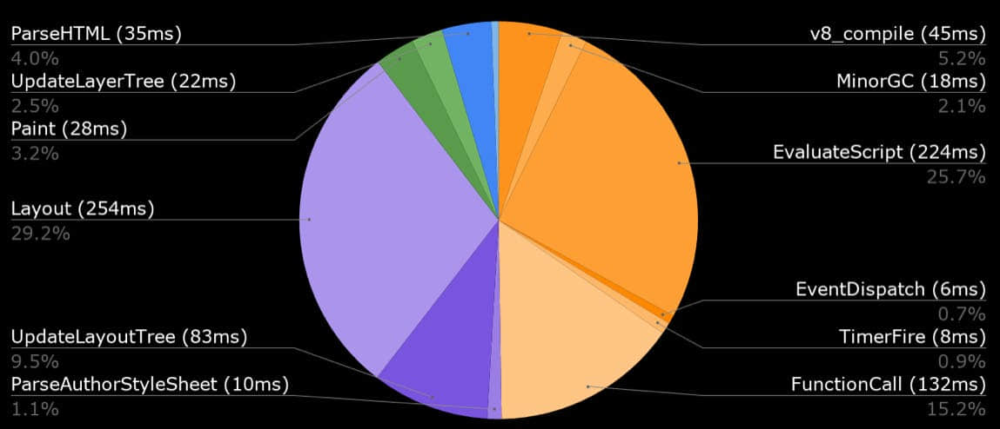
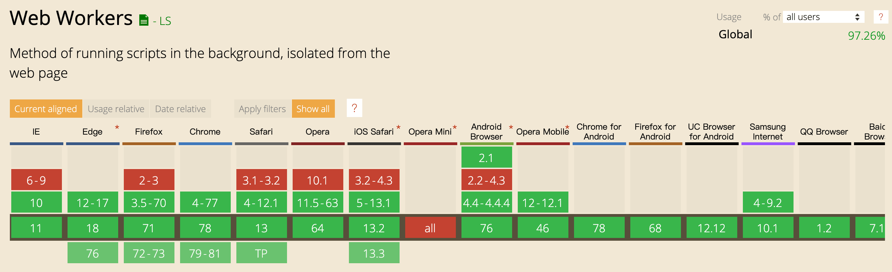
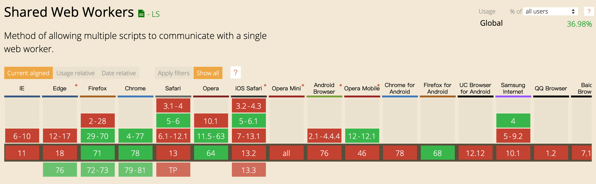
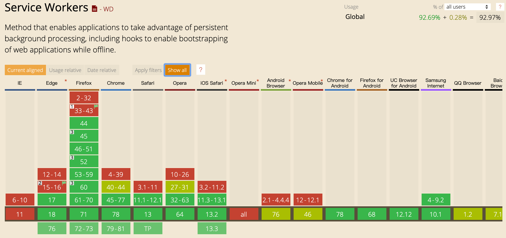
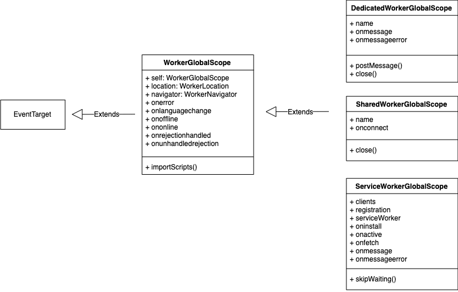
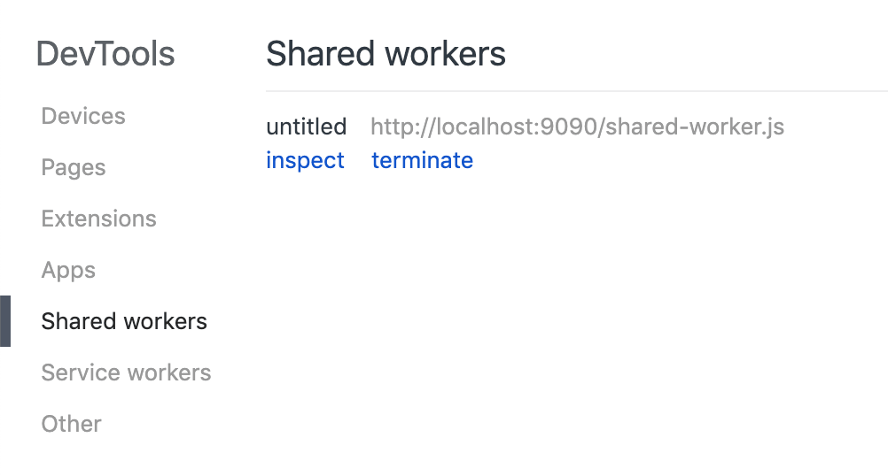

## 前言

每一年 Web 技术都在不断地突破边界，支持更多更强的特性，而这通常也意味着加载更多的脚本。

脚本通过网络加载到浏览器之后，还需要进行解析（parse）和执行（evaluate）



上图源自于一个[对 HTTP Archive 数据的研究](https://discuss.httparchive.org/t/cpu-time-breakdown/1510)，它展示了来自 `1300 万` PC 站点的统计数据所得出浏览器任务的平均 `CPU` 占用时间，我们可以看到执行 `JavaScript` 的耗时占比达到了 40% 以上。

因此可见，浏览器的主线程已经**不堪负重**，那么有没有什么办法可以减轻主线程的负担呢？

答：利用 `Web Worker`。

本篇文章将会对 `Web Worker` 进行介绍，并且站在**规范**的角度来解释一些开发者容易感到困惑的现象（问题）。

## Prerequisites

为了能够更加顺畅和轻松地阅读本文，读者最好能满足以下条件：

- 熟悉 `JavaScript` 的基本语法
- 熟悉 `EventListener` 的相关用法
- 熟悉 `JavaScript` 中的异步编程（`Async`, `Promise` 等）

## Web Worker

`Web Worker` 能够让脚本脱离于浏览器主线程并在后台持续运行，`worker` **线程/进程**可以在不打断用户界面的交互的情况下执行任务，执行 CPU 计算密集的任务，从而提高 Web 应用的性能。

你可能会注意到，上面我使用了 **线程/进程** 的描述，或许你曾经看到过诸如： "一个 Web Worker 会开启一个新的线程" 这样的说法，这样的说法并不完全准确。

因为，规范并没有限制浏览器一定要使用 `Thread` 来实现 `Web Worker` 的功能:

> Create a separate parallel execution environment (i.e. a separate **thread or process or equivalent construct**), and run the rest of these steps in that context. -- WHTWG Spec#Worker#Processing model

### Web Worker 的代价

拥有额外的线程确实是一件令人兴奋的事情，但是也不要忘了，**线程切换**和**维护消息队列**所带来的代价，并不是所有的场景都是适合使用 `Web Worker`。

通常来说，`Web Worker` 应该被用于生命周期持久的场景，因为启动一个 `Web Worker` 的代价是很大的，不仅仅体现在启动时的性能损耗，还体现在持久的内存消耗。

### Web Worker 的种类

所以 `Web Worker` 具体的运行宿主，**完全依赖于浏览器自身的实现**。

`Web Worker` 主要有三种类型:

- `Dedicated Worker`
- `Shared Worker`
- `Service Worker`

### 兼容性

Dedicated Worker:



Shared Worker:



Service Worker:



### Web Worker 的全局作用域

这三种 `Worker` 拥有不同的全局作用域 (`Worker Global Scope`), 但是都基于 [`WorkerGlobalScope`](https://html.spec.whatwg.org/multipage/workers.html#workerglobalscope) 扩展而来:



仔细观察会发现 `Service Worker` 的 `API` 是最多的（也是本章会重点讲解的）, 同时，像 `location` 和 `navigator` 这样的全局对象不同于 `window` 对象下的同名对象，它们是针对 `Web Worker` 所制定的。

细心的同学可能会有疑问了，似乎还有很多在 `Worker Global Scope` 中可以使用的 `API`，比如：

- `fetch`
- `cache`
- `setTimeout`
- `addEventListener` ...

这些 `API` 都是从哪里来的呢？答案是从 `EventTarget` 和 `WindowOrWorkerGlobalScope mixin` 当中来的。

其中 `addEventListener` 来自 `EventTarget`，`setTimeout`，`setInterval` 这类 `API` 来自于 `WindowOrWorkerGlobalScope`, 而 `fetch`, `cache` 这类 `API` 则来自于其他规范对于 `WindowOrWorkerGlobalScope` 的拓展:

> Other standards are encouraged to further extend it using `partial interface mixin WindowOrWorkerGlobalScope { … };` along with an appropriate reference. -- WHATWG Spec#WindowOrWorkerGlobalScope

因此许多能在 `Browser Context` 中访问的对象也可以在 `Worker` 中访问。

### Dedicated Worker

`Dedicated Worker` 顾名思义，一旦创建之后，会和它的 `创建者（creator）`绑定在一起，不过仍然可以通过 [`Message ports`](https://html.spec.whatwg.org/multipage/web-messaging.html#message-ports) 来和其他的 `browser context` 或者是 `worker` 进行通信。

值得注意的是，我们之所以可以在 `DedicatedWorkerGlobalScope` 中直接调用 `postMessage` 来跟 `worker` 的 `creator` 进行通信，是因为 `Dedicaated Worker` 在创建之初，就设置了一个**隐式**的 `port`，并且这个 `port` 永远不会在 `DedicatedWorkerGlobalScope` 之前被 `GC`:

> DedicatedWorkerGlobalScope objects act as if they had an **implicit MessagePort** associated with them. This port is part of a channel that is set up **when the worker is created**

> but it is not exposed. This object must **never be garbage collected before** the DedicatedWorkerGlobalScope object.

> -- WHATWG SPEC#Worker#DedicatedWorkerGlobalScope

#### 创建 Dedicated Worker

创建 `Dedicated Worker` 可以使用两种不同的模式来进行创建: `classic` 和 `module`, 不过现实骨感，目前除了 [Chrome 80](https://www.chromestatus.com/features/5761300827209728) 支持该特性以外，其他浏览器均不支持。

> `module` 模式指的是能够直接在 `worker` 中使用 `ESM`

使用 `Same-Origin url`:

```js
const worker = new Worker('/worker.js', {
  // classic 或者 module
  type: 'classic',
  // 默认为 classic, module 的兼容性还不是很理性
});
```

使用 `blob url` :

```js
const url = URL.createObjectURL(new Blob([`console.log('Hello Worker')`]));
const worker = new Worker(url);
```

使用 `data url`:

```js
const url = `data:application/javascript,${encodeURIComponent(
  `console.log('Hello Worker')`
)}`;
const worker = new Worker(url);
```

使用 `data url` 和 `blob url` 所创建的 `worker` 一般称之为 `inline-worker`

这两种方式创建出的 `worker` 所关联的 `origin` 称之为 [`opague origin`](https://html.spec.whatwg.org/multipage/origin.html#concept-origin-opaque), 反映为在 `worker` 的全局作用域的 `WorkerLocation` 中的 `origin` 的值为 `null`：

> 注意：并不是所有的页面都能够自由的使用 `blob url` 和 `data url` 来创建 `worker`，如果页面指定了特定的 [CSP](https://developer.mozilla.org/en-US/docs/Web/HTTP/CSP)，那么很有可能这种方式就会被禁止。因为使用这两种方式创建的 `worker` 会继承 `creator` 的 `CSP` 规则。

#### 终结 Dedicated Worker

调用 `terminate` 方法会立即终结 `worker` 的执行，并且**中断** `worker` 中的任何操作：

```js
// in browser context
worker.terminate();
```

所以比较安全的终结方案是向 `worker` 发送消息，并在 `worker` 的作用域中处理并主动关闭：

```js
// in browser context
worker.postMessage('terminate');

// in worker global scope
self.addEventListener('message', function(event) {
  if (event.data === 'terminate') {
    // finish unsetteled business ...
    self.close();
  }
});
```

#### Dedicated Worker Demo

`html` :

```html
<h2>DIGEST GENERATION:</h2>
<textarea
  id="input"
  type="textarea"
  placeholder="please input your text"
  rows="10"
  cols="50"
></textarea>
<div>
  <span>
    <strong>Digest:</strong>
  </span>
  <p id="digest">No digest for empty string</p>
</div>
```

`main.js` :

```js
const worker = new Worker('/worker.js');
const input = document.querySelector('#input');
const digest = document.querySelector('#digest');
input.addEventListener('input', event => {
  const text = event.target.value.trim();
  worker.postMessage({
    action: 'md5',
    value: text,
  });
  worker.addEventListener('message', event => {
    const { action, value = '' } = event.data;
    if (action === 'md5-result') {
      digest.textContent = value;
    }
  });
});
```

`worker.js` :

```js
importScripts(
  'https://cdn.jsdelivr.net/npm/blueimp-md5@2.12.0/js/md5.min.js',
  'https://cdn.jsdelivr.net/npm/lodash@4.17.15/lodash.min.js'
);

self.addEventListener(
  'message',
  _.debounce(event => {
    const { action, value = '' } = event.data;
    if (action === 'md5') {
      self.postMessage({
        action: 'md5-result',
        value: value.length > 0 ? md5(value) : 'No digest for empty string',
      });
    }
  }, 100)
);
```

详情请查看此 [Github Repo](https://github.com/Mactaivsh/web-workers-demo/tree/master/dedicated-worker)

#### 工程化

`Worker` 还有一些比较新奇的工程化手段，感兴趣的朋友可以自行查看这几个开源项目:

- [workerize](https://github.com/developit/workerize)
- [workerize-loader](https://github.com/developit/workerize-loader)
- [worker-loader](https://github.com/webpack-contrib/worker-loader)
- [comlink](https://github.com/GoogleChromeLabs/comlink)

### Shared Worker

`Shared Worker` 可以看做是 `Dedicated Worker` 的扩展，它也能实现 `Dedicated Worker` 能实现的功能，除此之外，它还可以和同个 `origin` 下的多个 `browser context` 进行异步通信。

不过，和 `Dedicated Worker` 不相同的是，`Shared Worker` 有一个特殊的属性 `name`, `name` 属性对于 `Dedicated Worker` 没有什么意义，而对于 `Shared worker` 来说，`name` 可以用来确定是否共用一个 `Shared worker`，还是创建不同的实例

#### 创建 Shared Worker

创建 `Shared Worker` 的 `API` 几乎和 `Dedicated Worker` 没有什么不同，除了第二个参数可以直接指定 `name`，或者是使用对象参数，以下三种方式都是等价的：

```js
new SharedWorker('./shared-worker.js', 'myWorker');

new SharedWorker('./shared-worker.js', { name: 'myWorker' });

new SharedWorker('./shared-worker.js', 'myWorker', { type: 'classic' });
```

`Shared Worker` 也和 `Dedicated Worker` 一样，可以使用 `data url` 和 `blob url` 创建, 不过如果要共用同个 `Shared Worker` 实例，`url` 必须一致。

同时，`Shared Worker` 也同样遵循页面的 `CSP` 规则。

#### 确定唯一性

`Shared Worker` 的唯一性由 `origin`, `script-url` 以及 `name` 决定

比如，在使用多个相同的 `script-url` 创建 `Shared Worker` 时，只会创建一个 `Shared Worker` 和多个和它的连接（`connection`）：

```js
new SharedWorker('./shared-worker.js');
new SharedWorker('./shared-worker.js');
new SharedWorker('./shared-worker.js');
```

相同 `script-url` 和不同的 `name` 会创建多个 `Shared Worker` 实例：

```js
new SharedWorker('./shared-worker.js', { name: 'sharedWorker-1' });
new SharedWorker('./shared-worker.js', { name: 'sharedWorker-2' });
new SharedWorker('./shared-worker.js', { name: 'sharedWorker-2' });
```

不同的 `origin` 下的 `Shared Worker` 可以使用相同的 `name`，不会和其他的 `origin` 产生冲突。

#### 使用 MessagePort 进行通信

创建了 `Shared Worker` 之后，我们需要通过其 `port` 属性进行通信：

```js
const worker = new SharedWorker('./shared-worker.js')
worker.port.postMessage('...')
worker.port.onmessage = function (event) {  // ...  }
```

这时候可能有些同学会发问了，为什么 `Shared Worker` 不能像 `Dedicated Worker` 那样直接 `postMessage` 呢，反而要 "多此一举" 地通过一个 `port` 属性？

首先我们要了解以下几点:

1. `Dedicated Worker` 和 `Shared Worker` 本身都是使用 [`MessagePort`](https://html.spec.whatwg.org/multipage/web-messaging.html#message-ports) 实现，而一个 `port` 必然需要和另外一个 `port` 进行 `entangle` 才能建立起联系。
2. 两个 `MessagePort` 如果有其中一个已经和其他的 `port` 产生了关联，那么必须先 `disentangle`

之前我们也提到了，`SharedWorker` 是会共享实例的，那么如何保证共享的实例和外部的联系不产生混淆呢？各自的单独的 `MessagePort` 便能保证这一点。

而 `Dedicated Worker` 并不存在 "共享" 的问题，所以它的 `port` 是隐式的，因此在 `API` 中隐藏了起来，但是 `port` 本身是确实存在的。

因此，通过 `new SharedWorker` 创建的不同 `worker` 的 `port` 是互不共享的：

```js
const worker1 = new SharedWorker('./shared-worker.js')
const worker2 = new SharedWorker('./shared-worker.js')

// pseudo code
assert(worker1.port ==== worker2.port) // AssertionError
```

那么如何在被共享的 `SharedWorker` 的环境内本身处理多个与外部的 `port` 的链接呢，规范中给出了这样的答案：

> fire an event named `connect` at worker global scope, with the data attribute initialized to the empty string, the `ports attribute` initialized to a `new frozen array containing only inside port`, and the `source attribute` initialized to inside port.

> -- WHATWG SPEC#Worker#SharedWorker interface

因此，我们可以在 `ShareWorker` 内部监听 `connect` 事件，并且处理内部的 `port`：

```js
const connections = new Set();

self.onconnect = function(event) {
  // this is more intuitive
  const newInsidePort = event.source;
  // or const newInsidePort = event.ports[0]
  connections.add(newInsidePort);
};
```

需要注意的是，每个 `MessagePort` 都有自己的 `port message queue`，这个 `queue` 必须要 `enable` 之后才能接受消息，初始化的时候是 `disabled` 的状态：

> Each MessagePort object also has a task source called the `port message queue`, initially empty. A port message queue can be enabled or disabled, and is `initially disabled`

> -- WHATWG Spec#Web-messaging#Message-ports

因此我们需要调用 `MessagePort` 对象的 `start` 方法，才能 `enable` 其 `port message queue` 并且开始接受消息：

```js
worker.port.start();
```

然而，还有一种例外的情况，如果不使用 `addEventListener` 监听 `message` 事件，而是添加 `onmessage` 回调，那么 `port message queue` 会被自动 `enabled`, 从而不需要手动调用 `start` 方法:

> The first time a MessagePort object's `onmessage` IDL attribute is set, the port's `port message queue must be enabled`, `as if the start() method had been called`.

> -- WHATWG Spec#Web-messaging#Message-ports

#### 终结 Shared Worker

因为 `Shared Worker` 的本质是共享的，所以无法提供像 `Dedicated Worker` 那样的 `terminate()` 方法来终结，必须要在其内部调用 `close()` 方法：

```js
// inside shared worker
self.close();
```

#### Shared Worker Demo

接下来这个 `demo` 简单地模拟了，不同 `context` 之间共享同一个 `Shared Worker` 并且互相通信的情形：

`index.html`:

```html
<body>
  <div class="container">
    <section>
      <p>status: <span id="status">initial</span></p>
      <div id="message">
        <h2>Messages</h2>
      </div>
      <div id="result"></div>
    </section>
    <iframe class="inner" src="./inner.html"></iframe>
  </div>
  <script src="./main.js"></script>
</body>
```

`inner.html`:

```html
<body>
  <p>Status: <span id="status">initial</span></p>
  <div id="message">
    <h2>Messages</h2>
  </div>
  <div id="result"></div>
  <script src="./main.js"></script>
</body>
```

`main.js`:

```js
window.onload = () => {
  const worker = new SharedWorker('./shared-worker.js');
  const status = document.querySelector('#status');
  const message = document.querySelector('#message');
  const result = document.querySelector('#result');
  let id = null;
  let messageCount = 1;

  worker.port.addEventListener('message', event => {
    const { data } = event;
    switch (data.action) {
      case 'id':
        id = data.value;
        break;
      case 'message':
        message.innerHTML += `<p><strong>No.${messageCount++}: </strong>${
          data.value
        }</p>`;
        break;
      case 'result':
        status.textContent = 'success';
        result.innerHTML = `
          <h2 style="text-align: center;">Github Trending</h2>
          ${renderTrendingList(data.value || [])}
        `;
        break;
      default:
        break;
    }
  });

  worker.port.start();

  setTimeout(() => {
    status.textContent = 'pending';
    worker.port.postMessage({
      action: 'start',
      value: id,
    });
  }, Math.floor(Math.random() * 10) * 1000);
};

function renderTrendingList(list) {
  return `
  <ul style="list-style: none; padding: 0;">
    ${list
      .map(item => {
        return `<li style="margin: .5em 0; border: 1px solid #ddd; padding: 0 15px;">
        <div>
          <p>Name: <strong>${item.name}</strong></p>
          <p>Description: ${item.description}</p>
          <p>Repo: <a href="${item.url}">${item.url}</a></p>
        </div>
      </li>`;
      })
      .join('\n')}
  </ul>
  `;
}
```

`shared-worker.js`：

```js
const connectedClients = new Set();
let id = 1;

let taskStated = false;
const endPoint = 'https://github-trending-api.now.sh/repositories?since=weekly';

function runTask() {
  if (taskStated) return;
  taskStated = true;
  // simulate network delay
  setTimeout(async () => {
    const response = await fetch(endPoint, { mode: 'cors' });
    const data = await response.json();
    sendMessageToClients({
      action: 'result',
      value: data,
    });
  }, 5000);
}

function sendMessageToClients(payload, currentClientId = null) {
  connectedClients.forEach(({ id, client }) => {
    if (currentClientId && currentClientId == id) return;
    client.postMessage(payload);
  });
}

// add listener to newly added client
function setupClient(clientPort) {
  clientPort.onmessage = event => {
    const { action, value } = event.data;
    if (action === 'start') {
      let sendValue = `client No.${value} start fetch task at <strong style="color: blue">${new Date().toUTCString()}</strong>`;
      if (taskStated) {
        sendValue += ', task already started';
      }
      sendMessageToClients(
        {
          action: 'message',
          value: sendValue,
        },
        value
      );
      runTask();
    }
  };
}

self.addEventListener('connect', event => {
  const newClient = event.source;
  connectedClients.add({
    client: newClient,
    id: id,
  });
  setupClient(newClient);
  // send id to current connect client
  newClient.postMessage({
    action: 'id',
    value: id,
  });
  newClient.postMessage({
    action: 'message',
    value: `You are client No.${id}`,
  });
  // notify all other connected clients
  sendMessageToClients(
    {
      action: 'message',
      value: `clients No.${id} connected`,
    },
    id
  );
  id++;
});
```

详情请查看此 [Github Repo](https://github.com/Mactaivsh/web-workers-demo/tree/master/shared-worker)

#### 调试 Shared Worker

`Shared Worker` 并不像 `Dedicated Worker` 那样，可以直接在 `Devtools` 的 `console` 面板中进行调试，目前来说 `Chrome` 对 `Shared Worker` 的调试的支持是最好的。

在 `Chrome` 中打开 [chrome://inspect/#workers](chrome://inspect/#workers) 页面，然后如果有 `tab` 正在使用 `Shared Worker`, 便可以看到类似的下面的画面：



点击 `inspect` 按钮会打开一个新的 `devtool` 窗口，里面的 `console` 环境便是 `SharedWorkerGlobalScope`

### Service Worker

这篇 `Blog` 写到这里的时候，并阅读了大量 Spec 之后，我意识到了 `Service Worker` 必须要单独开一篇新的文章来进行详细的阐述

虽然 `Service Worker` 也是 `Web Worker` 的其中一种，但是其功能作用和其约束又有很大的不同

因此为了避免内容的过多集中，我将新开一篇 `Blog` 单独地深入剖析 `Service Worker`, **敬请期待**

## References

- https://html.spec.whatwg.org/multipage/workers.html
- https://w3c.github.io/ServiceWorker
